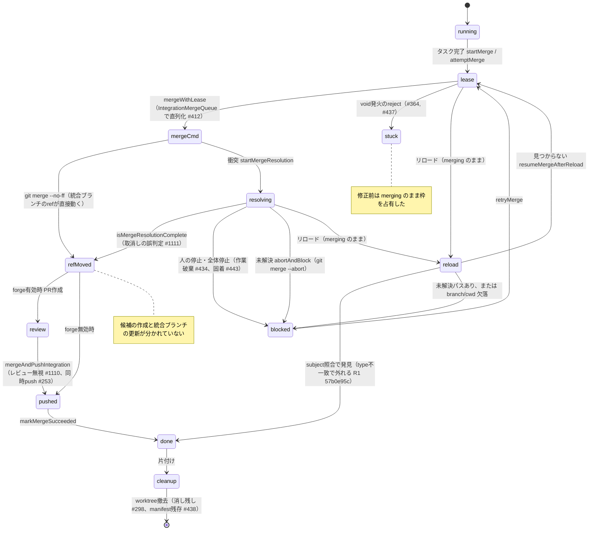

# マージ・再開の障害を原因の型で分け直す（Issue #1677）

調査日: 2026-09-29

## 目的と結論

ワークフローモードの「マージ・統合」と「再開・永続化」で起きた障害を、症状ではなく「最初に何が壊れたか」で分け直した。統合処理に追記型の実行履歴（journal）を足すかどうかをこの結果で決める。

- 対象は26件（統合15件、再開・永続化10件、fix commitだけで直った1件）
- 型ごとの件数は P 16件、S 6件、C 3件、R 1件、E 0件、Unknown 0件
- R型・E型の独立した種類は1つ（R1: マージ済み判定がcommit subjectの照合に頼っていて外れる）。判断基準の「2つ以上」に届かないため、journalのIssueは起票しない
- 最も多いのはP型（手順ミス）で、半数以上が「同じ防御が別経路に入っていない」「呼び出し・配線を忘れた」の2種類に収まる。クラッシュのタイミングで食い違う障害は、実際に起きた記録が無い
- S型6件のうち4件は「終わった・止めた状態から戻る遷移」を状態モデルが想定していなかったもの。#1679（状態の組み合わせ削減）の対象に「終了・停止からの復帰」を加える材料になる

## 対象の選び方

- `gh issue list --state closed`でタイトルが`fix`で始まるIssueのうち、マージ・統合worktree・再開・復元・永続化・マニフェストに関わるものを拾い、ワークフローモードの統合経路とrun復元に関係しないもの（チャットの引き継ぎ、ループ機能、履歴復元など）を除いた
- `git log --grep='^fix'`で`runnerMerge.ts`・`runnerRestore.ts`・`integration.ts`・`pseudoWorktree.ts`・`runStore.ts`を触ったfix commitを拾い、Issueと対応しないものを足した（#338のfix commit、57b0e95cの二重マージ）
- 議論資料の概算（統合約14件、再開約9件）より3件多い。概算の元の一覧は残っていないため、上の条件で列挙し直した

## 型と確度の定義

型はIssue #1677の定義に従う。

- P（手順ミス）: 呼び忘れ、分岐漏れ、配線漏れなど
- S（状態モデルの誤り）: 状態の定義や遷移そのものが誤っていて、行き止まりや矛盾が起きる
- R（git操作の完了を判別できない）: クラッシュ・リロード後に、merge・rebase・ref更新が済んだか判別できない
- C（並行処理の競合）: 排他なしのread-modify-write、非同期キューとの競合など
- E（外部操作の成功後、保存前に落ちる）: git操作などは成功したが、状態の保存より前に落ちて食い違う
- Unknown: どれとも判定できない

確度は次の基準で付けた。

- Confirmed: Issue本文またはfix commitが原因のコード位置を特定しており、その修正で直っている
- Probable: 原因は特定されているが、型の境界にあって別の型とも読める
- Unknown: 原因が特定されていない（今回は該当なし）

1件に複数の原因があるものは、最初に壊れた箇所の型を主とし、副次の型を根拠欄に書いた。件数は主の型だけで数える。

## 分類結果

### マージ・統合（15件＋1件）

1. #253 並列タスクで統合ブランチのpushが競合する — **C / Confirmed**。同じrankのタスクが`pushIntegrationBranch`を並列に呼び、同じrefへの同時pushが`cannot lock ref`で落ちた（e691387dで直列化とリトライ）
2. #298 片付けがworktreeを消しきれない — **P / Confirmed**。`removeWorktrees()`が現在の試行のworktreeしか撤去せず、疑似worktreeは撤去対象から漏れていた（efc0cca9）
3. #364 疑似worktreeの統合・反映で未ハンドルreject — **P / Confirmed**。`void integratePseudoWorktree(...)`と`void reflectPseudoWorktree(...)`にcatchが無く、タスクが`merging`のまま枠を占有した
4. #412 統合worktreeの排他が衝突解決の区間に及ばない — **C / Confirmed**。`IntegrationMergeQueue`の直列化単位が`git merge`1回だけで、その後の衝突解決セッションはキューの外で統合worktreeを触っていた（42c467aa）
5. #433 疑似worktreeの反映がシンボリックリンク境界を検証しない — **P / Confirmed**。同じファイルの他4経路は`findSymlinkedAncestor`と事後`realpath`の二段で確認しているのに、`reflectIntegrationToWorkspace`だけ字面判定だった（f173710d）
6. #434 全体停止が衝突解決の作業を`git merge --abort`で捨てる — **P / Confirmed**。`finishMergeResolution`の非破壊分岐が`manual`/`interrupted`だけを見ていて、`taskStopped`が破棄の分岐へ落ちた（f04409ff）
7. #437 `void`発火のマージ経路3つにrejectionの受けが無い — **P / Confirmed**。#364で疑似worktree側だけ塞ぎ、隣の分岐の`void startMerge(...)`などが残っていた。#364と同じ種類の再発
8. #438 撤去で`manifest.json`が消えず、復元で幽霊マニフェストを読み戻す — **P / Confirmed**。#380でマニフェストを永続化したとき、撤去側（`removePseudoWorktree`）を対応させていなかった
9. #443 人が止めた衝突解決タスクが`merging`のまま残る — **S / Confirmed**。`retryMergeState`は`blocked`からしか遷移せず、`getRunOutcome`は`merging`を実行中と数えるため、再マージもrun終了もできない行き止まりの状態があった
10. #485 反映の`rename`がオプショナルで、クラッシュ時に一時ファイルが残る — **P / Confirmed**。ポートの`rename`を型で必須にしておらず、TOCTOUに弱い旧経路へ黙って戻りうる。一時ファイルの残存はクラッシュで起きるが状態の食い違いではないためEとしない（36985b99）
11. #1110 PRレビューが失敗しても統合マージへ進む — **P / Confirmed**。`reviewPullRequest`の結果を分岐に使わず常に`mergeAndPushIntegration`を呼んでいた（c9e274c3）
12. #1111 マージの取消しを解決済みと判定する — **P / Probable**。`isMergeResolutionComplete`が「未解決パスなし・`MERGE_HEAD`なし」だけを見て、取込み対象が統合先に入ったかを確認しなかった。「git操作が済んだか判別できない」点はRに近いが、クラッシュ・リロードとは無関係な判定条件の不足なのでPとした（7e274cd9）
13. #1116 マニフェスト保存が非原子的で既存ファイルを失う — **C / Probable**。一次確認の後に保存先の祖先がリンクへ差し替わる競合が主。副次として、書込み途中の失敗で前回の記録を失う（Eに近い）経路もある（5519d7cf）
14. #1117 統合先へのコピーで境界を確認しない — **P / Confirmed**。境界検証が反映段階にしか無く、`applyDiffToIntegration`のコピーでは確認していなかった。#433と同じ「防御の配置漏れ」（1e588fb8）
15. #1118 スナップショットの読込み障害を削除として反映する — **P / Confirmed**。`readdir`/`stat`の全例外を空一覧・`undefined`に変換し、欠けた一覧を成功として差分計算へ渡していた（9d9fd88a）
16. 57b0e95c リロード後のマージ済み判定が外れて二重マージする — **R / Confirmed**。リロード時は統合ブランチのlogからmerge commitのsubjectを`type`込みの固定文言で探していた。`type`は永続化されておらず、YAMLの`type:`を書き換えた場合や旧形式のcommitでは見つからず、マージ済みのタスクを`merging`と判定して同じブランチを二重にmergeした。Issueは無く、#330のcommitで`reconcileMergingTaskOnReload`のJSDocに経緯が残っている

### 再開・永続化（10件）

17. #338（1c0c5a1e）リロード後に`add_task`/`remove_task`の結果と定義がずれる — **S / Confirmed**。`live.def`は永続化しない一方`live.runState`は他の経路で永続化されるため、復元時に定義と状態が食い違った。何を永続化するかの設計の不整合
18. #379 永続化の失敗にViewから気づけない — **P / Confirmed**。`persist()`の失敗をログにしか出さず、`live.warnings`へ積んでいなかった
19. #380 リロード復元後に統合成果がワークスペースへ届かない — **P / Confirmed**。`serializeManifest`/`deserializeManifest`が本体から呼ばれておらず、復元時に空のマニフェストで作り直していた。保存の仕組みはあったので配線漏れとした
20. #381 全体停止が衝突解決セッションを止めない／永続化の時点ずれ — **P / Confirmed**（副次にC）。`stop()`が`live.mergeResolutions`を走査していなかったのが主。副次として`persist()`が`outcome`を呼び出し時に計算し、直列キューのupdaterは別時点の状態を読むため`finishedAt`が食い違った
21. #475 run再開経路がメッセージングを再構築しない — **P / Confirmed**。`retryTask`/`continueTask`/`retryMergeState`が`setupMessagingForStart`を呼び直さず、再実行したタスクにMCP URLが渡らなかった
22. #491 終了したrunを再開してもオーケストレーターが制御ツールを失ったまま — **S / Confirmed**。設計が「run終了＝終わり」を前提にしており、`retryTask`で`finished`から走行中へ戻る遷移を想定していなかった（bf7a3baa）
23. #1114 疑似隔離の復元失敗後に元workspaceへ書き込む — **S / Probable**。「隔離を使わない」と「隔離の作成に失敗した」が同じ`pseudo: undefined`で表され、失敗が隔離なしとして扱われた。表現の不足と見てSとしたが、分岐漏れ（P）とも読める（3f027fa3）
24. #1115 リロード前の手動編集を反映基準へ取り込む — **S / Confirmed**。反映の比較基準（baseline）が永続化の対象に入っておらず、復元時に現在のworkspaceから取り直していた（3c2e065d）
25. #1549 オーケストレーターの自動引き継ぎでrunが止まる — **P / Confirmed**。`openOrchestratorSession`が`handoffDelegate`を渡しておらず、自動引き継ぎが立て直し経路に流れなかった。後半の「次のrunが始まらない」も連鎖起動の配線漏れ
26. #1626 全タスク完了で終わったrunを再開しても、再読込で終了に戻る — **S / Confirmed**。`reopenTaskRun`は`finishedAt`だけを外し、`planStatus`とタスクの完了状態を残すため、リロード時の`finishTaskRunIfDone`が再び終了と判定する。再開後の状態が「終了の条件を満たしたまま開いている」矛盾を持つ（コードを読んで確認。実機では再現させていない）

## 集計

- P（手順ミス）: 16件 — #298, #364, #433, #434, #437, #438, #485, #1110, #1111, #1117, #1118, #379, #380, #381, #475, #1549
- S（状態モデルの誤り）: 6件 — #443, #338, #491, #1114, #1115, #1626
- C（並行処理の競合）: 3件 — #253, #412, #1116
- R（git操作の完了を判別できない）: 1件 — 57b0e95c
- E（外部操作の成功後、保存前に落ちる）: 0件
- Unknown: 0件

P型16件のうち13件は次の2種類に収まる。残る3件（#1110, #1111, #1118）は判定条件の不足と例外の握りつぶしである。

- 同じ防御が別経路に入っていない（7件）: #364と#437（rejectionの受け）、#433と#1117（シンボリックリンク境界）、#438（撤去側がマニフェストに未対応）、#434（停止理由の分岐）、#485（型で強制していない）
- 呼び出し・配線を忘れた（6件）: #298, #379, #380, #381, #475, #1549

### R型・E型の独立した種類

- R1: マージ済みかの判定をcommit subjectの文字列照合に頼っている（57b0e95c）。同じ原因の再発は今のところ無い
- E: 0種類。統合でマージcommitを作った後、`done`を保存する前に落ちる経路は構造上ありうるが、リロード時の`reconcileMergingTaskOnReload`がsubject照合で`done`へ戻すため、食い違いとして報告された障害は無い
- #1111（取消しを解決済みと判定）と#1116（非原子的な保存）はR・Eに近い性質を持つが、主の型はそれぞれPとCとした

独立した種類は合計1つ。判断基準（2つ以上なら統合処理にだけjournalを足すIssueを起票）に届かないため、journalのIssueは起票しない。

ただしR1の根本（`originCommit`がメモリ上だけで、merge commitのSHAを保存しない）は、統合処理の集約（#1678）の方針「試行の状態をgit操作の前に保存し、リロード後はSHAで判定する」がそのまま塞ぐ。journalを別に作るより、#1678の中で扱うほうが小さい。

### S型から#1679へ渡すもの

S型6件のうち4件（#443, #491, #1626, #1114）は「止めた・終わった・失敗した状態から戻る遷移」を状態モデルが想定していなかったものだった。残り2件（#338, #1115）は「何を永続化するか」の範囲の不足で、再開時に現在値から取り直した値が食い違った。

#1679で状態の組み合わせを減らすときは、次の2点を対象に加える。

- 終了・停止からの復帰（`merging`の固着、`finished`からの再開、再開後に終了条件を満たしたままの状態）
- 復元時に取り直している値のうち、永続化すべきもの（基準、隔離の有無と失敗の区別）

## 統合の流れ（現状）

ワークフローモードで、タスクの完了から統合ブランチの更新と片付けまでを、タスクの状態で描いた。遷移に付けた番号は、その遷移で起きた障害の出典である。

現状は「統合候補の作成」と「統合ブランチの更新」が分かれていない。統合worktreeで統合ブランチをcheckoutしたまま`git merge --no-ff`するため、候補ができた時点でrefが動く。検証は衝突解決後の`isMergeResolutionComplete`とPRレビューだけで、ref更新の後に行う。

疑似worktree（非gitワークスペース）の統合は別経路で、タスク完了時に`applyDiffToIntegration`で統合先ディレクトリへコピーし（#1117, #1118）、run終了時に`reflectIntegrationToWorkspace`でworkspaceへ反映する（#433, #485, #1115）。マニフェストの保存・復元・撤去は#380, #438, #1116で直している。
