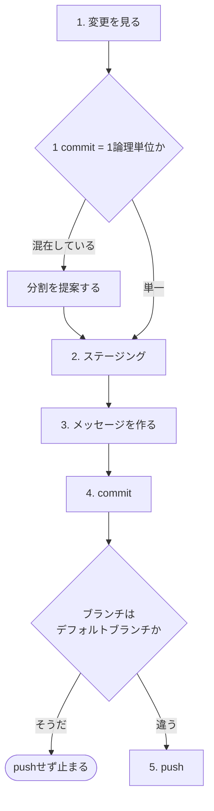

# gitlab-commit

**自発的な連続commitを避ける**。実装の途中で無関係な区切りごとに勝手にcommitが刻まれると、後から分割し直せない。人間が「いまcommitする」と明示したとき、または `codex-ext:gitlab-develop` が1タスク完了のタイミングで明示的に呼んだときだけ動く。誤発火の抑止はdescriptionのUse when / Do not useで行う。

呼び方は、Claude Codeは `/codex-ext:gitlab-commit`、Codexは `$codex-ext:gitlab-commit`。

リポジトリの `CLAUDE.md`・`AGENTS.md` (あれば `CONTRIBUTING.md`) にcommitの書式やブランチの扱いの定めがあれば、それを読んで従う。このskillが書く値は、定めが無いときの既定値である。

## 起動のされ方

| 起動元 | 何が違うか |
| --- | --- |
| 利用者が直接呼ぶ | ローカル作業ファイルの更新漏れを確認する (下記) |
| `codex-ext:gitlab-develop` から呼ばれる | 呼び出し元がローカル作業ファイルを更新するため、ここでは触らない |

## 手順



### 1. 変更を見る

```bash
git status
git diff --stat
git diff
```

**差分を読まずにcommitしない**。意図しない変更 (デバッグ用の出力、別セッションが触ったファイル、`.env`) が混ざる。

### 2. ステージング

**`git add -A` と `git add .` を使わない**。ファイルを明示指定する。

```bash
git add <path> <path>
```

一括ステージは、秘密情報や巨大なバイナリ、別の作業ブランチのファイル、別セッションが作業中のファイルを巻き込む。

#### 1 commit = 1論理単位

次が混ざっているなら分ける。

| 混在の例 | なぜ分けるか |
| --- | --- |
| 実装 + 無関係なリファクタ | リファクタだけを戻せない |
| 依存更新 + 機能追加 | 依存が原因の不具合を切り分けられない |
| 複数バグの修正 | 1つを戻すともう1つも戻る |
| 実装 + そのテスト | **分けない**。同じ変更の一部として1つにまとめる |

分割が要ると判断したら、**commitする前に提案する**。勝手に分けても勝手にまとめてもいけない。

#### ステージした内容を見る

commitする前に、ステージした差分そのものを見る。

```bash
git diff --cached --stat
git diff --cached
```

**次の2つが混ざっていないかを見る**。どちらもcommitしてpushすると取り消せない。

```bash
# 資格情報
git diff --cached | grep -inE 'api[_-]?key|secret|passwd|password|token|BEGIN [A-Z ]*PRIVATE KEY'

# 作業ドラフト
git diff --cached --name-only | grep -E '^docs/(issue|mr)/'
```

どちらも**ヒットしないことが正常**。grepが何も返さなければ次へ進む。

検出パターンそのものを本文に含むファイル (このskillのような手順書) をcommitするときは偽陽性が出る。**ヒットした行が実際の値かパターンの記述かを目で見て切り分ける**。ヒットしたという理由だけで機械的に止めない。

資格情報が引っかかったら、**commitせずに止まる**。値をコードから外し、環境変数か秘密情報の管理先へ移してから作り直す。既にcommit済みなら、履歴からの除去とその値の失効 (rotate) の両方が要る。

作業ドラフト (`docs/issue/issue-<IID>.md` / `docs/mr/mr-<MRのIID>.md`) は**ローカル限定でリモートへpushしない**。ヒットしたらステージから外し、`.git/info/exclude` に次が入っているかを確認する。入っていなければ追記する。リポジトリの `.gitignore` は書き換えない。

```
docs/mr/
docs/issue/
```

### 3. メッセージを作る

書式は `<type>(<scope>): <subject>`。`scope` は任意。

| type | 用途 |
| --- | --- |
| feat | 新機能 |
| fix | バグ修正 |
| refactor | 挙動を変えない構造改善 |
| docs | ドキュメントのみ |
| test | テストのみ |
| chore | 依存・設定・雑務 |
| perf | パフォーマンス改善 |
| ci | CI設定 |

- 件名は50文字を目安に、末尾に句点を打たない
- 言語はリポジトリの既存のcommit履歴に合わせる。履歴から判断できなければ利用者との会話の言語で書く。日本語なら体言止めか、動詞で終える形にする
- bodyは任意。**なぜそうしたか**を書く。何をしたかは差分を見れば分かる
- 破壊的変更は `<type>(<scope>)!: <subject>` とし、bodyに移行内容を書く

#### commitに書かないもの

リポジトリ規約に別の定めがなければ、次は書かない。

| 書かないもの | 理由 |
| --- | --- |
| `Closes #<IID>` / `Refs #<IID>` | Issueとの紐付けはMR本文の `Closes #` に集約する。commitとMRの両方にあると、どちらが正かが分からなくなる |
| `Co-Authored-By: ...` などのAI帰属表記 | `Generated with ...` / `Authored by ...` も同様。ツール名や生成者名を示す表記を書かない |
| 絵文字 | 履歴を検索・表示しやすくするため |

混入していないか確認する。

```bash
git log -1 --format=%B | grep -iE 'co-authored-by:|authored by|generated with' && echo "NG: 帰属表記が混入している"
```

### 4. commit

```bash
git commit -m "<type>: <subject>"
```

**`--no-verify` と `-n` は使わない**。pre-commit hookを飛ばすと、リポジトリが守りたい検査が通らないままcommitされる。hookが落ちたら出力を読んで原因を直す。

### 5. push

デフォルトブランチを決め打ちしない。

```bash
DEFAULT=$(git symbolic-ref --short refs/remotes/origin/HEAD 2>/dev/null | sed 's|^origin/||')
CURRENT=$(git branch --show-current)

if [ -z "$DEFAULT" ] || [ -z "$CURRENT" ]; then
  echo "判定できない (DEFAULT='$DEFAULT' CURRENT='$CURRENT')。pushしない"
elif [ "$CURRENT" = "$DEFAULT" ]; then
  echo "デフォルトブランチ ($DEFAULT) への直接pushは禁止。MR経由にする"
else
  git push
fi
```

**判定できないときはpushしない**。ここを省くと2つの経路でガードが無効になる。

| 状態 | 何が起きるか |
| --- | --- |
| `origin/HEAD` が未設定 | `symbolic-ref` が失敗して `DEFAULT` が空になる。空文字とブランチ名の比較は常に偽なので、**デフォルトブランチにいてもpushが通る** |
| detached HEAD | `git branch --show-current` が空になる。同じく比較が偽になる |

`origin/HEAD` が無い場合は次で設定できる (リモートを1回参照する)。

```bash
git remote set-head origin --auto
```

**`[ 条件 ] || { echo ...; }` の形で書かない**。メッセージを出すだけで後続の `git push` が素通りし、ガードにならない。分岐でpushそのものを包む。

初回は `-u origin "$CURRENT"` を付ける。`git push -f` と `--force` は使わない。

## 検証の扱い

**このskillはcommit前の検証 (テスト・型チェック・lintなど) を自動では走らせない**。検証はタスクの区切りで必要なときに手動で回す。リポジトリ規約や利用者の指示が検証の実行を求めている (または止めている) ならそれに従い、実行しなかった検証はMR本文と完了報告に未実行として記録する。pre-commit hookが走るのはgitの通常の動作であり、ここでいう自動実行には含めない。

## 単独起動されたとき

`codex-ext:gitlab-develop` は「commitのたびに `docs/issue/issue-<IID>.md` を更新する」と定めている ([gitlab-developのimplement.md](../gitlab-develop/references/implement.md))。単独で起動されると、これが漏れる。

ブランチ名からIIDを取り、該当ファイルがあれば**更新を促す。自動では書かない**。何を消化したかは実装した本人にしか分からない。

```bash
IID=$(git branch --show-current | cut -d/ -f2)
case "$IID" in
  ''|*[!0-9]*) echo "ブランチ名から取ったIIDが数字だけではない。促さずに終える" ;;
  *) ls "docs/issue/issue-${IID}.md" 2>/dev/null ;;
esac
```

**数字であることを確かめる**。`<type>/<IID>/<slug>` に従わないブランチ (`main`、`hotfix/urgent/fix` など) では2つ目の要素が数字にならず、存在しないファイルや無関係なファイルを指す。

促す内容は2つ。

- `### 実装計画` のうち、今のcommitで消化したチェック
- 試して駄目だったことがあれば `### 試したこと` へ1行

## 失敗パターン

| 失敗 | 対処 |
| --- | --- |
| commitする差分が無い | `git add` を忘れている。`git status` を見る |
| pre-commit hookが落ちた | 出力を読んで直す。自動整形が走った場合は再ステージングが要る |
| 帰属表記が混入した | `git commit --amend` で直す。push前なら安全 |
| 間違ったファイルをcommitした | push前なら `git reset --soft HEAD^` で戻す。push後は打ち消しcommitを作る |
| `--amend` したくなった | push済みなら履歴が壊れる。**利用者の明示指示があるときだけ**行う |

## 前提

`git` が使えること。このskill自体は `glab` を使わないが、pushする先はGitLabのリポジトリを前提にしている。pushの認証が通らないなど、GitLab側の準備が足りないときは `codex-ext:gitlab-init` を案内する。
