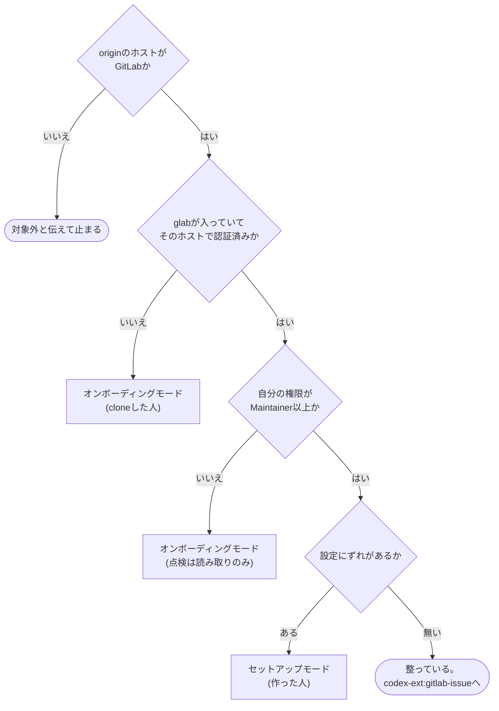

# gitlab-init

リポジトリを`codex-ext:gitlab-issue`から始められる状態にする。主な仕事は、`glab`の用意、認証、remoteのホストの確認である。リポジトリを作った人には、GitLab側の設定の点検も行う。

## 前提

- GitLabのホストは決め打ちしない。`git remote get-url origin`のURLから求める。**他の`codex-ext:gitlab-*`のskillも、ホストの求め方と`glab`への渡し方はここに書く方法に揃える**。URLの形は次のいずれか。
  - `https://<ホスト>[:<port>]/<group>/<project>.git`
  - `git@<ホスト>:<group>/<project>.git`
  - `ssh://git@<ホスト>[:<port>]/<group>/<project>.git`

  ```bash
  URL=$(git remote get-url origin)
  HOST=$(printf '%s' "$URL" | sed -E -e 's#^https?://([^/]*@)?([^/]+).*#\2#;t' -e 's#^(ssh|git|git\+ssh|ssh\+git)://([^/]*@)?([^/:]+).*#\3#;t' -e 's#^[a-z+]+://.*##;t' -e 's#^([^/]*@)?([^/:]+):.*#\2#;t' -e 's#.*##')
  ```

  - この式の正本はここ。同じsed式を`codex-ext:gitlab-develop`・`codex-ext:gitlab-issue`・`codex-ext:gitlab-review`のSKILL.mdと、`gitlab-review`の`scripts/review-packet.sh`にも書いている (各skillは単独で読まれるため)。式を変えるときは、この同梱skill群の中で`s#^https?://`を固定文字列で検索 (`grep -rnF 's#^https?://'`など) し、全箇所を揃える
  - https・httpのURLはポートを残す (`gitlab.example.com:8443`)。ssh://・scp形式 (`git@host:g/p.git`) はポートを落とす。SSHのポートはAPIのポートではないため
  - httpで運用しているGitLabでは、`GITLAB_HOST`にホストだけを渡すと`glab`はhttpsで接続する (schemeを付けても同じ。glab 1.117で確認)。`glab config set -h <ホスト> api_protocol http`が要る。グローバル設定の変更なので利用者の承認を得てから行う
  - サブパス配置のGitLab (`https://example.com/gitlab/g/p.git`など) はこの式では扱えない。`GITLAB_HOST`の代わりに`-R <URL全体>`を使う

  ホストが`github.com`ならGitLabのリポジトリではない。このskillと`codex-ext:gitlab-*`の他のskillは使えないので、そう伝えて止まる。

- GitLabの操作は`glab` CLIで行う。ホストは**各`glab`コマンドの前に`GITLAB_HOST=<求めたホスト>`を付けて**渡す (例: `GITLAB_HOST=gitlab.example.com glab auth status`)。Bash呼び出しごとにシェルが変わるため、`export`は次の呼び出しへ残らない。例示が必要なときは`gitlab.example.com`を使う
- 点検と適用を分ける。差分を提示して、利用者が選んだものだけ適用する。プロジェクト設定は他の人にも影響し、元に戻しにくい
- 利用者の環境設定 (シェルの設定ファイル、`glab`のグローバル設定、エージェントのグローバル設定) は勝手に変えない。変更が要るなら手順を示して承認を得る。他のプロジェクトにも影響する
- コマンドが失敗したら先へ進まない。取得に失敗した項目は「不明」として残す。取得失敗を「設定されていない」と読み替えない
- デフォルトブランチを`main`と決め打ちしない。gitコマンドとAPIで確認する
- Claude Codeでは選択を求める場面で`AskUserQuestion`が使える。Codexでは会話の中で選択肢を示して答えを待つ

## モードの判定

起動したらまずここを通る。モードを指定させない。



```bash
git remote get-url origin
command -v glab && glab --version
glab auth status
```

`glab auth status`は、認証先のホストがoriginのホストと一致しているかを読む。一致していなければ未認証として扱う。

| | セットアップモード | オンボーディングモード |
| --- | --- | --- |
| 誰が | リポジトリを作った人、Maintainer以上 | cloneした人 |
| 前提 | `glab`認証済み、Maintainer権限 | gitとエージェントのみ |
| GitLabの設定 | 点検して、選ばれたものを適用する | 触らない |
| 規約ファイル | 無ければ最小の`CLAUDE.md`か`AGENTS.md`を提案する | 読んで規約を把握する |
| `glab` | 使える前提 | インストールと認証から始める |
| 利用者の環境設定 | 触らない (確認のみ) | 触らない (確認のみ) |

判定が割れたら聞く。`glab`は入っているが認証が切れている、権限が取得できない、といった中間状態がある。どちらのモードで何をするかを提示してから進む。

判定結果を1行で伝える。例: 「オンボーディングモード。`glab`が入っていない」。

## セットアップモード

[references/setup.md](references/setup.md)を読む。

## オンボーディングモード

[references/onboarding.md](references/onboarding.md)を読む。

## 出口基準

モードごとに1つを満たす。

- セットアップモード: 差分を提示し、選ばれたものを適用し、再点検で反映を確認した
- オンボーディングモード: `glab`が使える状態になり、リポジトリの規約と機械強制の有無を伝えた

共通:

- [ ] 判定したモードとその根拠を利用者へ伝えている
- [ ] 見た項目と見ていない項目を区別して伝えている。「点検した」が「全部見た」に読まれないようにする
- [ ] 整っていない項目が残るなら、それが何を妨げるかを添えている
- [ ] `codex-ext:gitlab-issue`から始められる状態かどうかを明示している

## やらないこと

- 設定の無断変更: 点検して差分を出すところまで。適用は利用者が選んだものだけ
- 利用者の環境設定の変更: シェルの設定ファイルの環境変数、エージェントのグローバル設定。確認までで、変更は提示にとどめる
- `glab`の自動インストール: パッケージマネージャの操作は環境全体に影響する。手順の提示までとする
- 認証の代行: `glab auth login`はブラウザかトークンの入力が要る。skillが代われない
- リポジトリの新規作成: `glab repo create`は1コマンドで済む
- CI設定の中身: 言語・テスト構成に依存する。骨組みまで ([references/ci-template.md](references/ci-template.md))
- Issueの起票や実装: `codex-ext:gitlab-issue`・`codex-ext:gitlab-develop`の担当
