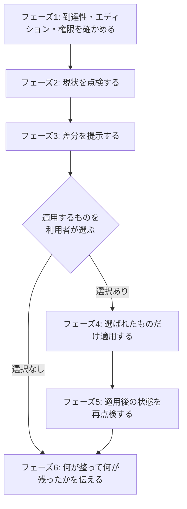

# セットアップモード

[SKILL.md](../SKILL.md)から参照される。リポジトリを作った人 (Maintainer以上) が、GitLab側の設定を点検し、必要なものを適用する。



フェーズ3で必ず止まる。利用者が選ぶまで何も変えない。

`glab`の応答の判定と停止は、すべて[glab-response.md](../../gitlab-develop/references/glab-response.md)に従う。以降の各`glab`実行でも同じ。

`glab`にホストを渡す必要があるときは、[SKILL.md](../SKILL.md)の前提のとおり、originのURLから求めたホストを各`glab`コマンドの前に`GITLAB_HOST=<ホスト>`で付ける。

## フェーズ1: 到達性・エディション・権限

最初に到達性を見る。GitLabが社内ネットワークやVPNの内側にあると、認証情報があっても経路が無ければ通らない。`TLS handshake timeout`や`Connection reset by peer`は認証の失敗ではないので、認証をやり直しても直らない。

```bash
curl -s -o /dev/null -w '%{http_code}\n' --max-time 15 https://<ホスト>/
```

`000`で時間切れなら、ネットワークまたはVPNの接続を確認する。到達できないまま点検へ進むと全項目が「不明」になり、出力が意味を持たない。

```bash
glab api version
```

出力から`version`と`enterprise`を読む。

```bash
glab api "projects/:id"
```

出力から`permissions.project_access.access_level`と`default_branch`を読む。

```bash
glab --version
git symbolic-ref refs/remotes/origin/HEAD
```

### エディション

`enterprise: false`なら承認ルールは存在しない。Community Editionにはこの機能が無い。

```
glab api "projects/:id/approval_rules"  → {"error":"404 Not Found"}
glab api "projects/:id/approvals"       → {"error":"404 Not Found"}
```

CEでは、承認を必須にして自己マージを設定で止めることができない。運用でしか担保できないので、リポジトリの規約ファイルにレビューとマージの運用を書く ([agents-md-template.md](agents-md-template.md))。

404を承知で叩かない。失敗が当たり前になると、本当の失敗に気づけなくなる。

### 権限

`access_level`が40 (Maintainer) 未満なら、保護ブランチとプロジェクト設定を変更できない。点検だけ行い、変更が要る項目は「権限不足」として提示する。

| 値 | ロール | できること |
| --- | --- | --- |
| 50 | Owner | すべて |
| 40 | Maintainer | 保護ブランチ、プロジェクト設定、ラベル |
| 30 | Developer | ラベルのみ。設定は変更できない |

### デフォルトブランチ

`main`と決め打ちしない。`git symbolic-ref refs/remotes/origin/HEAD`の出力と、`projects/:id`の`default_branch`の両方で確かめる。

`master`など別の名前のリポジトリでは、保護ブランチの点検対象もそちらになる。以降の手順で`main`と書いてある箇所はすべてこの値に読み替える。

### `glab`のバージョン

サブコマンドの有無と非推奨はバージョンで変わる。記録しておく。

- `glab mr note -m`は非推奨。`glab mr note create <IID> --message`を使う
- `glab issue note`に`create`サブコマンドは無い。`glab issue note <IID> --message`が正しい
- discussionを操作するサブコマンドは存在しない。`glab api`を直接叩く
- wikiを操作するサブコマンドも存在しない。`glab api "projects/:id/wikis"`を使う

使っている版で違うときは`glab <サブコマンド> --help`で確かめる。

## フェーズ2: 点検

[checklist.md](checklist.md)の項目を上から流す。

取得できなかった項目は「不明」として残す。取得失敗を「設定されていない」と読み替えない。設定されていないことと、確認できなかったことは違う。

## フェーズ3: 差分を提示する

現状・推奨・ずれていると何が起きるか・適用コマンドを表で並べる。

```text
| 項目 | 現状 | 推奨 | ずれていると | 適用 |
| only_allow_merge_if_all_discussions_are_resolved | false | true | 未対応の指摘を残したままマージできる | glab api ... |
```

「推奨だから」で終わらせない。何が壊れるかが書いていないと、適用するかどうかを判断できない。

推奨値とその根拠は[checklist.md](checklist.md)にある。リポジトリの規約ファイル (`CLAUDE.md`・`AGENTS.md`・`CONTRIBUTING.md`) に別の定めがあれば、そちらを推奨として扱う。既に異なる設定があるリポジトリでは、上書きせず利用者に確認する。

### 見ていない項目を明示する

GitLabの設定項目は多く、全部は見られない。点検した項目と、見ていない項目を分けて伝える。「点検した」が「全部見た」に読まれると、見ていない場所の問題を見落とす。

## フェーズ4: 適用

選ばれた項目だけを実行する。1項目ずつ実行し、失敗したらそこで止まる。

### プロジェクト設定

```bash
glab api "projects/:id" -X PUT --form only_allow_merge_if_all_discussions_are_resolved=true
glab api "projects/:id" -X PUT --form remove_source_branch_after_merge=true
glab api "projects/:id" -X PUT --form auto_devops_enabled=false
```

`-f` (`--raw-field`) ではなく`--form`を使う。ネストしたキーを渡す場合に`-f`は通らない。

`only_allow_merge_if_pipeline_succeeds`は、CIが動くことを確かめてから`true`にする ([ci-template.md](ci-template.md))。

### 保護ブランチ

```bash
glab api "projects/:id/protected_branches" -X POST \
  --form name=<デフォルトブランチ> \
  --form push_access_level=40 \
  --form merge_access_level=40 \
  --form allow_force_push=false
```

`merge_access_level`はチームの運用に合わせる。Developer (30) にMRのマージを許すなら30にする。

既に保護されている場合は、先に削除してから作り直す必要がある。削除は一瞬だが、その間は保護が外れる。作り直しに失敗すると無防備なまま残るため、削除と作成を続けて実行し、結果を確認する。

### ラベル

```bash
glab label create --name "bug" --color "#d9534f" --description "不具合"
glab label create --name "feature" --color "#5cb85c" --description "機能追加"
glab label create --name "chore" --color "#777777" --description "雑務・整備"
glab label create --name "research" --color "#5bc0de" --description "調査"
```

Issueの種別 (`codex-ext:gitlab-issue`が本文の先頭に書く種別) と揃える。揃っていないと、ラベルと本文で種別が食い違う。既にラベルがあるリポジトリでは、同じ意味のものを重複して作らない。説明文は、リポジトリの言語に合わせる。

### 作業ドラフトのpush除外

`codex-ext:gitlab-issue`と`codex-ext:gitlab-develop`は、`docs/issue/`と`docs/mr/`にローカルの作業ドラフトを置く。これがpushされないよう、利用者のリポジトリの`.gitignore`は書き換えず、`.git/info/exclude`へ追記する。

```bash
EXCLUDE="$(git rev-parse --git-path info/exclude)"
for p in docs/issue/ docs/mr/; do
  grep -qxF "$p" "$EXCLUDE" || echo "$p" >> "$EXCLUDE"
done
```

`.git/info/exclude`はそのクローンだけに効く。他のクローンでも同じ除外が要るなら、リポジトリの規約として`.gitignore`へ入れるかを利用者に確認する。

### 規約ファイル

リポジトリに`CLAUDE.md`も`AGENTS.md`も無く、`CONTRIBUTING.md`にも開発の進め方が書かれていないときだけ、最小のものを提案する。[agents-md-template.md](agents-md-template.md)を読む。既にある場合は上書きせず、不足している項目だけを提示する。

### CI

CIが無いリポジトリでは、[ci-template.md](ci-template.md)の骨組みを示す。テストコマンドはプロジェクトごとに書くため、骨組みから先は利用者と決める。

## フェーズ5: 再点検

適用した項目を、フェーズ2と同じAPIで読み直して反映を確かめる。適用コマンドが返ったことは、反映された証拠にならない。

## フェーズ6: 報告

整った項目、残った項目、見ていない項目を分けて伝える。残った項目には、それが何を妨げるかを添える。`codex-ext:gitlab-issue`から始められる状態かどうかを明示する。
