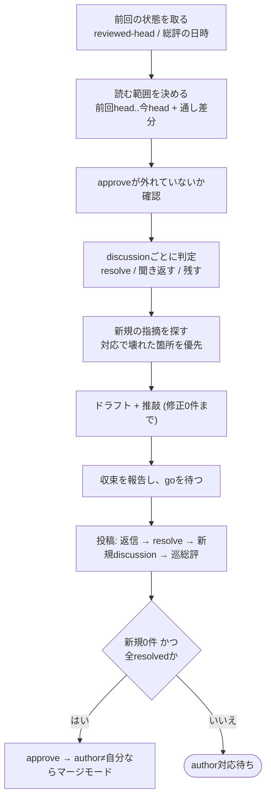

# 再レビュー

[SKILL.md](../SKILL.md) の現在地判定で「再レビュー」と決まったときに読む。自分の総評noteがすでにあり、その後にauthorのpushか返信が入ったMRに対して、2巡目以降を通す手順。初回の観点と推敲の基準は review.md、投稿コマンドは posting.md、noteの本文は note-template.md。

## 目的

前回の指摘が対応されたかを判定し、対応で新たに壊れた箇所が無いかを確かめ、収束したらapproveする。**前回と同じ範囲を同じ深さで読み直すのではない**。前回の総評を起点に差分を絞る。

**他者レビューで広く指摘を出すのは初回の1巡だけ**。既定であり、リポジトリの `CLAUDE.md` / `AGENTS.md` に記載があればそちらを優先する。再レビューは前回指摘の対応確認として行い、新規の指摘は `medium` 以上 (`critical` / `high` / `medium`) に限る (対応の副作用、前回の見落としのどちらでも)。`medium` 以上が残る間は承認しない。

## 手順



## 前回の状態を取る

SKILL.md の判定で得た `reviewed-head` と総評の日時をそのまま使う。

```bash
PREV_HEAD=<reviewed-headのsha。no-markerなら versions から前回の head_commit_sha を取る>
PREV_AT=<前回総評の created_at>
```

`HEAD`・`BASE` は、SKILL.mdの状態取得手順で実行済みの `glab mr view "$IID" --output json` の出力から `diff_refs.head_sha` / `diff_refs.base_sha` を読む。

`no-marker` のときは `glab api "projects/:id/merge_requests/$IID/versions"` を並べ、前回総評の日時の直前に作られたversionの `head_commit_sha` を `PREV_HEAD` にする。判断に迷うなら、その旨を伝えて通し差分だけで進める。

## 読む範囲

```bash
git fetch origin
git log --oneline $PREV_HEAD..$HEAD                     # 前回以降のcommit
git diff --stat $PREV_HEAD...$HEAD                       # 前回以降の差分
git diff $BASE...$HEAD --stat                            # 通し差分 (最終巡は必ず全部読む)
```

| 巡                                 | 読む範囲                                                                                      |
| ---------------------------------- | --------------------------------------------------------------------------------------------- |
| 途中の巡                           | `$PREV_HEAD..$HEAD` を全部。通し差分は変更ファイルの周辺だけ                                  |
| 収束が見えた巡 (新規0件になりそう) | **通し差分 `$BASE...$HEAD` を全部読み直す**。対応の積み重ねで初回と別物になっていることがある |

**`PREV_HEAD..HEAD` にIssueと無関係な変更が混ざっていたら、それは新規の指摘**。指摘対応の名目で機能追加が入ることがある。

**force pushでhistoryが書き換わっていたら `$PREV_HEAD..$HEAD` が空か意味を失う**。`git merge-base --is-ancestor $PREV_HEAD $HEAD` が非ゼロなら、通し差分だけで読み直す。

## approveの確認

```bash
glab api "projects/:id/merge_requests/$IID/approvals"
```

出力から `approved_by[].user.username` の一覧と `approvals_left` を読む。応答の判定と停止は[glab-response.md](../../gitlab-develop/references/glab-response.md)に従う。

**`glab` は1回のBash呼出に単独で書く**。パイプ・コマンド置換・ファイルへのリダイレクトを付けない (sandbox付きセッションではコマンドがsandbox内で走り、GitLabホストへの接続を拒否されることがあるため)。

前回approveしていたのにpushで外れていたら、今回の収束判定でもう一度approveする。外れたこと自体は指摘ではない。

## discussionごとの判定

自分が立てたdiscussionを1件ずつ見る。SKILL.mdの状態取得手順で保持しているdiscussions出力から、`notes[0].author.username == ME` かつ `notes[0].resolvable == true` の要素だけを選び、各要素について `id` の先頭8桁、`notes[0].resolved`、`system == false` な返信 (`notes[1:]`) の件数、`notes[0].position.new_path`:`new_line` (無ければ「行なし」)、`notes[0].body` の冒頭50文字を読む。

| authorの返信と差分の状態                       | 判定                  | やること                                                               |
| ---------------------------------------------- | --------------------- | ---------------------------------------------------------------------- |
| 修正commitがあり、差分で指摘の内容が直っている | **resolve**           | 差分を開いて確かめてからresolve。返信の「直した」だけで判断しない      |
| Won't fixで根拠が書いてあり、根拠が妥当        | **resolve**           | 「根拠を了承」と返信してからresolve                                    |
| Won't fixで根拠が無い、または妥当でない        | **聞き返す**          | なぜ妥当でないかを1行で返信。severityは変えない                        |
| 返信が無く、差分でも直っていない               | **残す**              | 何もしない。巡総評の「未対応」に数える                                 |
| 返信は「直した」だが差分で直っていない         | **聞き返す**          | 該当の行を示して返信。新規の指摘にはしない                             |
| 直したが別の壊し方をしている                   | **残す + 新規の指摘** | 元のdiscussionには「直っていない」と返信し、新しい問題は別discussionへ |

**resolveは差分で確かめてから**。返信の文面だけで resolve しない。**resolveは中身で判断し、reviewerが実行する**。authorにresolveさせない。

**severityを下げて逃がさない**。highを「対応が大変そうだから」mediumにしない。対応が大変なら、それはそのまま残す。

## 新規の指摘

読む順番は、**対応で壊れた箇所 → 対応で追加された箇所 → 通し差分** の順。

初回で見つけられなかった問題が見つかることもある。その場合は「前回見落とした」と総評に書いて出す。**見落としを隠して次の巡に回さない**。

新規の指摘の書き方と推敲は review.md の「指摘を書く」「ドラフトと推敲」に従う。機械検査 (アンカー、件数、`reviewed-head`)・読解検査・実証ファクトチェックを同じ基準で、修正が0件になるまで回す。**推敲の対象は新規の指摘だけではない** — 各 discussion への返信文と巡の総評も同じ検査にかける。resolve の根拠 (「直っている」と言える理由) はとくに実証で裏を取る: 差分を読んだだけで閉じない、author の「対応した」を写さない、テストが指摘を捉えていることはミューテーションで確かめる。

### 出しにくい指摘

| 状況                                   | どうするか                                                        |
| -------------------------------------- | ----------------------------------------------------------------- |
| 前回言うべきだったが言わなかったlow    | 今回も言わない。再レビューで初めてlowを出すのはauthorの時間を奪う |
| 対応の副作用で出た新しい `medium` 以上 | 出す。副作用であることを書く                                      |
| lowで意見が割れている                  | authorの判断に任せてresolveする。承認を妨げない                   |

## 巡総評

note-template.md の「再レビュー総評」に従う。書くのは次の4つ。

- **前回からの対応**: 修正N件 / Won't fix N件 / 未対応N件 (合計が前回の指摘数と一致すること)
- **新規の指摘**: N件、severity内訳
- **承認可否**: 承認 / 保留
- **`reviewed-head`**: 今回読んだhead

**未対応が残っているのに「承認」と書かない**。ただしコード修正を伴わない指摘だけが残っている場合は「承認 (残件はドキュメントのみ)」と書いてよい。

## 投稿前のゲート

review.md と同じ。返信・resolve・新規discussion・巡総評の全部をユーザーへ提示してgoを待つ。事前に「収束したら投稿してよい」と言われていた場合だけ自動で進む。

投稿の順番は **返信 → resolve → 新規discussion → 巡総評**。総評を先に出すと、件数が本文と合わなくなる。

## approveと収束

| 状態                                          | やること                                                                                        |
| --------------------------------------------- | ----------------------------------------------------------------------------------------------- |
| 新規0件 かつ 全件resolved                     | **自分の総評noteもresolveする** (posting.md)。approveする。authorが自分でなければマージモードへ |
| 新規0件、残りがすべてコード修正を伴わない指摘 | approveしてよい。マージはそれらが片付いてから                                                   |
| コード修正を伴う指摘が残っている              | approveしない。author対応待ち                                                                   |

approveの条件は SKILL.md の「全モード共通の規則」が正。ここで緩めない。

### 止まる条件

| 状況                                                                                   | どうするか                                                                                                                                                       |
| -------------------------------------------------------------------------------------- | ---------------------------------------------------------------------------------------------------------------------------------------------------------------- |
| **同じ `medium` 以上の指摘が、指摘対応を2回経ても解消しない** (address.mdの基準と同じ) | 同じ指摘の言い換えで巡を重ねていないかを疑う。指摘の意図が伝わっていないか、設計レベルの問題を細部の指摘で埋めようとしている。**ユーザーへ状況を提示して止まる** |
| 対応のたびに新しい問題が増える                                                         | 対応の範囲が広がりすぎている。MRを分けることを提案する                                                                                                           |
| authorがWon't fixを繰り返し、根拠で決着しない                                          | lowならresolveして通す。medium以上ならユーザーへ判断を仰ぐ                                                                                                       |

## やらないこと

- **返信の文面だけでresolveする** — 差分で確かめる
- **authorにresolveさせる** — reviewerが実行する
- **収束の巡で通し差分を読まない** — 最終巡は必ず全部読む
- **severityを下げて逃がす**
- **再レビューで初めてlowを出す**
- **未対応を残して「承認」と書く** — コード修正を伴わない残件だけなら書いてよい
- **goを得ない投稿**
- **総評を先に投稿する** — 返信 → resolve → 新規 → 総評の順
