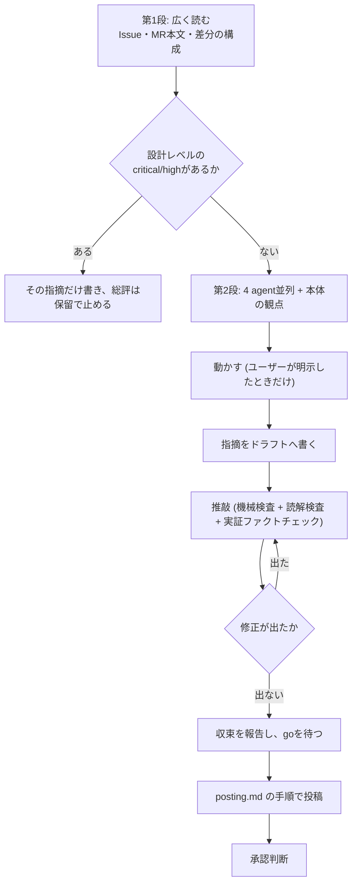

# 初回レビュー

[SKILL.md](../SKILL.md) の現在地判定で「初回レビュー」と決まったときに読む。自分の総評noteがまだ無いMRに対して、最初の1巡を通す手順。2巡目以降は review-followup.md、投稿コマンドは posting.md、noteの本文は note-template.md に書いてある。

## 目的

このMRをマージしてよいかを判断し、判断の根拠をauthorと第三者が追える形で残す。

判断の軸は「マージするとコードの健全性が上がるか」。完璧かどうかではない。ただし**受入基準を満たしていない、または壊れるものは通さない**。

**`$IID`は[SKILL.md](../SKILL.md)の「対象のMRを特定する」で数字だけであることを確認済みの値を使う**。ここでは確認し直さない。

## 手順



**設計レベルの問題があるなら細部を見る前に止める**。命名やテストの指摘を50件書いた後で「そもそもこの構成では受入基準を満たせない」と言うと、50件が無駄になる。第1段で気づいたら、その指摘だけを先に出す。

## 第1段: 広く読む

差分の中身を読む前に、何を実現しようとしているMRかを掴む。

```bash
glab mr view $IID --output json
```

出力から `description` を読む。本文中の `Closes #<IID>` / `Refs #<IID>` の記述も併せて確認する。応答の判定と停止は[glab-response.md](../../gitlab-develop/references/glab-response.md)に従う。

```bash
glab issue view <IssueIID> --output json
```

出力の `description` を読む。応答の判定と停止は[glab-response.md](../../gitlab-develop/references/glab-response.md)に従う。

Issueから**受入基準を1件ずつ書き出す**。書き出しておかないと、レビューの終わりに「受入基準は満たしている」と書けなくなる。Issueに受入基準が無いなら、それ自体を指摘する。

先の `glab mr view $IID --output json` の出力から `diff_refs.base_sha` (BASE) と `diff_refs.head_sha` (HEAD) を読み、以降の値として使う。

```bash
git fetch origin
git diff --stat $BASE...$HEAD
git log --oneline $BASE..$HEAD
```

`--stat` で主要なファイルを見つけ、そこだけ先に読む。ここで見るのは次の3つ。

- Issueの受入基準に対して、この構成で足りるか
- 変更が本来触るべき範囲に収まっているか (差分の大半がIssueと無関係なら、それが最初の指摘になる)
- 既存の設計と矛盾していないか

**MR本文の記述と差分の中身が食い違っていたら、それも指摘に入れる**。MR本文はレビューの入力であると同時に、後から履歴を読む人の入口になる。

## 第2段: 4 agentを並列に起動する

第1段で止まらなかったら、細部を見る。4つのagentへ観点を割り当て、**同一ターンで並列に起動する**。割り当て表、agentが返らなかったときの扱い、報告の統合手順は [review-common.md](review-common.md) にある。記録先は総評。

起動の前に、本体が このskillのベースディレクトリ (SKILL.mdがあるディレクトリ) の `scripts/review-packet.sh $BASE $HEAD <IID>` を1回だけ実行する。標準出力に出るディレクトリが対象の正本で、差分・変更ファイル一覧・commit件名・Issue本文・MR本文・base/headのSHAが入っている。**agent側に `git` / `gh` を実行させない**。取得を4重に走らせると、そのためのターンだけで1本あたり数ターンを使う。

各agentへは「severityと証拠の強さ付きで `file:line` と再現条件を添えて報告せよ」と伝える。

### 本体だけが見る観点

agentには渡せない文脈を本体が持つ。

- **差分の意図**: authorがなぜこう書いたか。MR本文とcommit messageに書かれた理由が差分と合っているか
- **受入基準の解釈**: 曖昧な受入基準をauthorがどう解釈したか。その解釈は妥当か。妥当でないならIssueの側を直すべきか
- **他の作業との衝突**: 同じファイルを触っている別MRが無いか (`glab mr list --per-page 20`)
- **MR本文とIssue本文の整合**: 「試した方法」「採用しなかった方針」がIssueに残っているか。残っていないなら指摘する

### 動かす

**ユーザーが「動かして確認して」と明示したときだけ**チェックアウトして動かす。

```bash
git worktree add "${TMPDIR:?}/review-$IID" origin/<source_branch>
cd "$TMPDIR/review-$IID" && <対象リポジトリのテストコマンド>
```

確認が終わったら撤去する。

```bash
git worktree remove "${TMPDIR:?}/review-$IID"
```

動かさなかったら、総評の「確認したこと」に「読んだだけ」と書く。動かしていないのに「テストが通ることを確認した」とは書かない。

## 指摘を書く

### severity

[review-common.md](review-common.md) の「severity」の表 (4段階) を使う。他者レビューでは「承認への影響」の列で扱いを決める。high以上の指摘には再現条件が要る (同節)。

### 1件ごとに決めること

- **コード修正が要るか**: 要る / 要らない (ドキュメント、MR本文、Issue本文の修正で済む)。承認判断で使う
- **スコープ内か**: このMRの範囲外の問題は指摘にせず、別Issueを提案する。「ついでに直して」と書かない
- **1指摘1スレッド**: 1つのdiscussionに2つの問題を書かない。resolveの単位が崩れる

### 良かった点

**総評に良かった点を1つ以上書く**。世辞ではなく、次のMRでも続けてほしい具体的な書き方を挙げる。指摘だけの総評は、何を守ればよいかが伝わらない。

## ドラフトと推敲

指摘はローカルのファイルへ書く。1件1ファイル。

```bash
mkdir -p "$TMPDIR/mr-$IID"
# $TMPDIR/mr-$IID/M1.md M2.md ... (行に紐づく指摘)
# $TMPDIR/mr-$IID/L1.md L2.md ... (行に紐づかない指摘)
# $TMPDIR/mr-$IID/summary.md      (総評)
```

本文の形式は note-template.md に従う。書き終えたら**投稿する前に推敲する**。修正が出なくなるまで繰り返す。

### 機械検査

読み直す前に、機械的に確かめられることを先に潰す。

| 検査                               | 方法                                                                                         |
| ---------------------------------- | -------------------------------------------------------------------------------------------- |
| アンカー行がhunkに含まれるか       | `git diff -U0 $BASE...$HEAD -- <file> \| grep '^@@'` の `+N,M` に `new_line` が入っているか  |
| アンカー行の内容が指摘と一致するか | `git show $HEAD:<file> \| sed -n '<line>p'` で指している行を表示し、指摘の文面と突き合わせる |
| 件数が合うか                       | 総評の表の行数 = severity内訳の合計 = ドラフトファイルの数                                   |
| 1指摘1スレッドか                   | 各ドラフトに問題が1つだけ書いてあるか                                                        |
| 総評に `reviewed-head` があるか    | `grep -c 'reviewed-head: [0-9a-f]\{40\}' summary.md` が1                                     |

アンカーのずれは投稿すると直せない (discussionを消して立て直すしかない)。**アンカーは全件、行の内容まで確かめる**。

### 読解検査

機械検査が通ったら、指摘を1件ずつ読み直す。

- **事実か**: 指摘している振る舞いは、差分を読んで確かめたものか。agentの報告をそのまま写していないか
- **検証した / していないの区別**: 「テストが落ちる」と書くなら落としたのか。読んで推測したなら「読んだ限りでは」と書く
- **スコープ**: このMRで直すべきことか。別Issueに送るべきものが混ざっていないか
- **severityと再現条件**: high以上に再現条件があるか。再現条件を書けないものがhighになっていないか
- **総評の自己矛盾**: 「承認」と書きながら受入基準の未確認を挙げていないか。件数が本文と合っているか
- **文体**: 対象リポジトリの規約 (空白、用語) に合っているか。絵文字が無いか

### 実証ファクトチェック

読解検査が通ったら、**ドラフトに書いた事実の主張を1つずつ拾い、証拠を実際に取りに行く**。「自分ではそう読めた」は証拠ではない。ここで落ちる主張が毎巡いくつか出るので、機械検査・読解検査と同じく**修正が0件になるまで回す対象に含める**。

まず主張を洗い出す。指摘本文・返信・総評の全文から、次に当たる文をすべて列挙する。

- 数値 (件数、行番号、テスト件数、パイプライン/job のID、commit SHA)
- 状態の断定 (「CIは緑」「この関数は呼ばれない」「文言はこう変わった」「先祖返りしていない」)
- 因果の断定 (「この失敗の原因はタイムアウト」「この変更でこのテストが通るようになった」)
- 他者の主張の引き写し (author が返信で「対応した」「手編集していない」と書いた内容)

次に、主張ごとに**どう確かめたか**を割り当てる。

| 主張の型                 | 実証の取り方                                                                                                                                                  |
| ------------------------ | ------------------------------------------------------------------------------------------------------------------------------------------------------------- |
| コードがこうなっている   | `git show $HEAD:<file> \| sed -n '<range>p'` で現物を出す。記憶や agent の報告で書かない                                                                      |
| 到達可能/不可能          | 呼び出し元を全部 grep する。**プロパティ名や引数名で grep する** (型名やコンポーネント名だけだと取りこぼす)                                                   |
| 実行するとこうなる       | 実際に走らせる (テスト、`TestClient` 等の小さな probe、CLI)。走らせた出力を根拠にする                                                                         |
| テストが指摘を捉えている | **ミューテーション**。対象を意図的に壊して RED になるか、戻して GREEN になるかを見る。壊したら必ず復元し、`git status --porcelain` が空であることまで確認する |
| CIの状態                 | job 単位で API から取る。パイプライン全体の色だけで「緑」「赤」と書かない。`allow_failure` と、他ブランチでも同じ赤かを見る                                   |
| 他者の主張               | **鵜呑みにせず独立に検証する**。マージが手編集を含まないなら blob と diff を親と突き合わせる、対応したと言うなら差分と実行結果で確かめる                      |
| 見た目                   | visibility.md に従う。画像を見ていないなら「見ていない」と書く                                                                                                |

確かめられなかった主張は、消すか、**書ける範囲まで弱める**。断定 (「原因はXだ」) を観測 (「Xの短縮表示だけ取得。Xとみている」) に落とす。**確かめていないのに確かめた体で書かない**。実測できた主張は、根拠 (job ID、コマンド、出力の要点) を本文に残す — 相手が同じ手順で追試できる形にする。

**巡数と最終巡の修正内容を報告する**。「3巡、最終巡はL4のアンカーを668→671に修正」のように。修正が出た巡の次にもう1巡回す。修正が出なかった巡で終える。

## 投稿前のゲート

推敲が収束したら、ユーザーへ次を提示してgoを待つ。

- 指摘の件数とseverity内訳
- 各指摘の1行要約 (severity、`file:line`、コード修正の要否)
- 総評の承認可否
- 推敲の巡数と最終修正

**ユーザーが事前に「収束したら投稿してよい」と言っていた場合だけ、goを待たずに投稿する**。それ以外はここで止まる。投稿の手順は posting.md。

## 承認判断

総評noteの「承認可否」と、GitLabのapproveは別のもの。

| 承認可否 | 意味                                                                                   |
| -------- | -------------------------------------------------------------------------------------- |
| 承認     | 残っている指摘があっても、それを直せばマージしてよい状態。何を直せば承認できるかを書く |
| 保留     | 設計レベルの問題、または受入基準の未充足があり、直った後にもう一度見る必要がある       |

GitLabのapproveを実行する条件は次のいずれか。

| 条件                                                                             | 判定            |
| -------------------------------------------------------------------------------- | --------------- |
| 指摘が0件                                                                        | approveしてよい |
| 全件resolvedで、次はマージ                                                       | approveしてよい |
| 残っている指摘が**すべてコード修正を伴わない** (ドキュメント、MR本文、Issue本文) | approveしてよい |
| コード修正を伴う指摘が1件でも残っている                                          | approveしない   |

初回レビューで指摘が1件でもある場合、通常はapproveしない。**総評に「承認」と書くことと、approveを実行することは独立している**。「承認」と書いてapproveしない状態は正常。

**approveはマージではない**。approveした後にマージへ進むかは SKILL.md の判定に戻る。

## やらないこと

- **第1段を飛ばして細部から読む** — 設計の問題を見落とし、細部の指摘が無駄になる
- **agentの報告をそのまま指摘にする** — 候補として受け取り、差分で事実を確かめてから書く
- **再現条件の無いhigh** — 書けないならhighではない
- **スコープ外の指摘** — 別Issueを提案する
- **推敲なしの投稿** — 機械検査・読解検査・実証ファクトチェックが収束するまで投稿しない
- **裏を取らない断定** — 実証できなかった主張は消すか弱める。他者の「対応した」もそのまま写さず自分で確かめる
- **goを得ない投稿** — 事前指示が無い限り、収束を報告して止まる
- **動かしていないのに動かしたと書く** — 「読んだだけ」と書く
- **コード修正を伴う指摘が残っている状態でのapprove**
