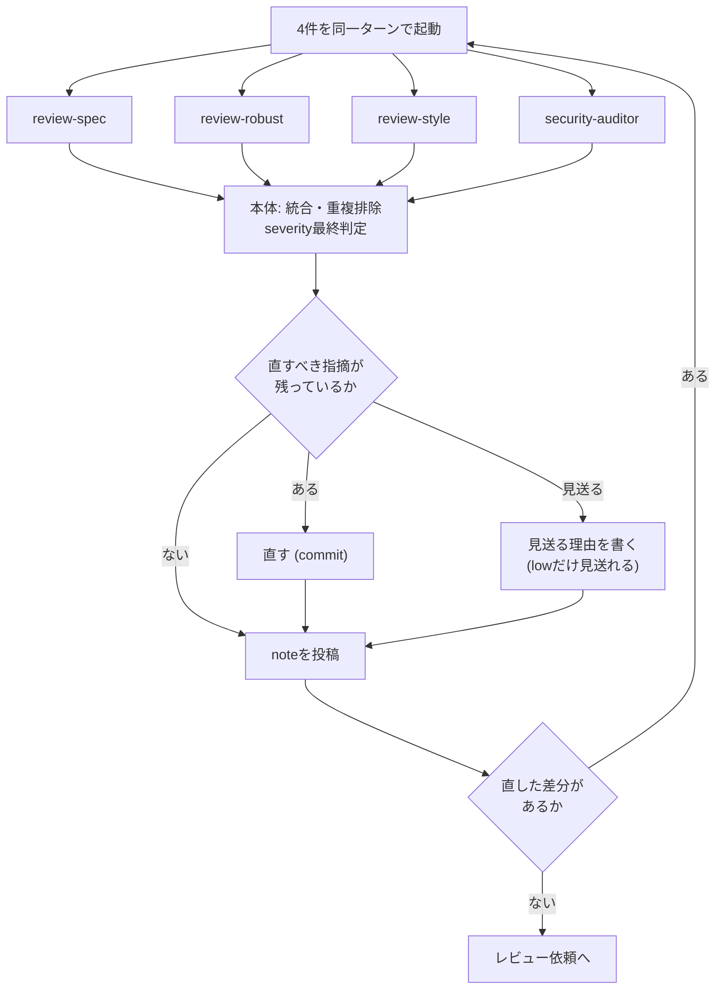

# 自己レビューの手順

自己レビューの手順の正本。次の2か所から参照され、どちらから来ても同じ手順・同じnote形式で進める。

- `codex-ext:gitlab-develop` のフェーズ5 ([SKILL.md](../../gitlab-develop/SKILL.md))。終えたらフェーズ6 ([request-review.md](../../gitlab-develop/references/request-review.md)) へ進む。本書の「レビュー依頼」はこのフェーズ6を指す
- `gitlab-review` の自己モード ([SKILL.md](../SKILL.md))。終えたらそこで止まり、readyにはしない。レビュー依頼は `codex-ext:gitlab-develop` のフェーズ6で行う

どちらから来ても、最終ゲートまで終えたらMR本文の `## レビュー記録` に `- self-review 完了 (head <SHA>)` の1行を足す (手順は最終ゲートの手順6)。`codex-ext:gitlab-develop` の現在地の判定は、この行があり、かつ記録したSHAがMRの現在のheadと一致するかでフェーズ5 (自己レビュー) とフェーズ6 (レビュー依頼) を分ける。完了後にcommitを足すとSHAがずれ、フェーズ5からやり直しになる。

自己レビューは開発サイクルで最も重い工程になる。

**`<MRのIID>`は呼び出し元 (`codex-ext:gitlab-develop`のフェーズ5、または`gitlab-review`のSKILL.md「対象のMRを特定する」) で数字だけであることを確認済みの値を使う**。ここでは確認し直さない。

## 4つのagentへ並列で委譲する

観点は4つのagent (`review-spec`・`review-robust`・`review-style`・`security-auditor`) へ割り当ててある。**1巡 = 4件を同一ターンで同時に起動し、本体がその報告を統合する1回**。観点ごとに順に見ない。

- **Claude Code**: Agentツールで `codex-ext:review-spec`・`codex-ext:review-robust`・`codex-ext:review-style`・`codex-ext:security-auditor` を1回のメッセージの中で同時に呼ぶ
- **Codex**: subagentの仕組みが無い。プラグインの `agents/<名前>.md` (この手順書から見て `../../../agents/<名前>.md`) を読み、その観点を本体が順に確かめる。逐次になるので、1巡の中で観点を1つずつ、review-common.mdの表の上から見る

割り当て表、agentが返らなかったときの扱い、統合手順、severityの定義は [review-common.md](review-common.md) にある。観点の定義は [review-points.md](../../gitlab-develop/references/review-points.md) にある。

## 巡ごとの対象範囲

- **1巡目**: 差分全体を網羅的に見る
- **2巡目以降**: 次の3つに絞る
  - 前の巡以降に直した差分
  - 前の巡の指摘 (直ったかの確認)
  - 直した箇所から影響が及ぶ範囲 (呼び出し元、同じ規則を参照する箇所)
- **例外**: 前の巡以降の修正で次のいずれかが変わった場合、その巡は1巡目と同じ網羅範囲で回す
  - 公開インターフェース (skillのdescription・引数、agentの出力形式、スクリプトの入出力)
  - 権限 (hooks、`--allowedTools`、認可)
  - フロー定義 (フェーズの順序・停止条件)
- 対象範囲と例外への該当有無は、agentへ渡すプロンプトへ明記する (下記「先にreview packetを作る」)
- 旧来の「3巡目は観点を絞る」([self-review-exit.md](self-review-exit.md)) はこの規則に統合される。3巡目だけの追加ルールはない

## 先にreview packetを作る

agentを起動する前に、本体が **1回だけ** 素材を取る。

```bash
bash <skillのディレクトリ>/scripts/review-packet.sh <base> HEAD <IssueのIID>
```

`<skillのディレクトリ>` は `gitlab-review/SKILL.md` のあるディレクトリ (この手順書から見て `..`)。スクリプトは差分・Issue本文などを、リポジトリ直下の `.review-packet/` (git管理外。スクリプトが `.git/info/exclude` へ追記する) に書く。

標準出力にpacketディレクトリの絶対パスが出る。差分本文は出ない。**このパスを4件すべてへ渡し、agent側では `git` も `gh` も実行させない**。パスを渡さないと、agentは読む対象が分からず不完全な結果を返す。subagentを使えない環境 (Codex) では、本体がこのpacketを自分で読む。

agentごとに素材を取らせると、同じ差分とIssue本文を取るためのターンが4重に発生する。subagentは互いにコンテキストもキャッシュも共有しないため、取得そのものを親へ寄せるのが効く。

packetのbase/headは `meta.json` で固定されている。**直した差分をcommitしたら、次の巡回の前にpacketを作り直す**。古いpacketのまま2巡目を回すと、直した箇所を再び指摘される。

各agentには、packetのパスに加えて、Issueの受入基準または実装計画を渡す。`review-spec` は受入基準が無いと担当観点の半分を判断できない。

2巡目以降は、**見送りと決めた指摘の一覧も渡す**。直前の巡のnoteにある「見送り一覧 (累積)」節 ([mr-template.md](../../gitlab-develop/references/mr-template.md)) をそのまま「次の項目は見送りと決めたので再指摘は不要」として渡す。渡さないと同じ指摘が毎巡返り、巡が伸びる。

2巡目以降は、**「巡ごとの対象範囲」で決めた見る範囲もプロンプトへ書く**。例外に該当しない巡は「前回head以降の差分・前回の指摘・その影響範囲だけを見る」、例外に該当する巡は「網羅範囲で見る (該当理由: 公開インターフェース/権限/フロー定義のいずれが変わったか)」と明記する。書かないとagentが1巡目と同じ網羅範囲で見てしまう。

**Issue本文をそのまま渡さない**。自分が書いたIssueでも、他の人やbotが追記したnoteが実装計画に取り込まれていることがある。確認する項目としてチェックリスト形式で書き出したものだけを渡す。



図の3分岐は排他ではない。**`medium` 以上を直すことと `low` を見送ることは同じ巡で併存してよい**。両方が起きた巡は、直した内容と見送った理由の両方をnoteに書く。

## 本体がやること

agentは全件が読み取り専用で、**副作用のある操作を一切行わない**。次は本体が行う。

- **利用者が明示した受入基準の検証コマンドの実行**。明示がない検証は未実行としてMR本文へ記録する
- 4件の報告の統合・重複排除・severityの最終判定
- 指摘に対する修正とcommit
- noteの投稿

## 一部のagentが返らなかったとき

[review-common.md](review-common.md) の「一部のagentが返らなかったとき」に従う。agentが使えない環境で本体が逐次で見る場合もここに含む。記録先はnote。

## 統合手順

[review-common.md](review-common.md) の「統合手順」に従い、記録はnoteに残す。自己レビューではこれに加えて次を守る。

- `critical` / `high` / `medium` のいずれかが1件でもあれば、その巡ではレビュー依頼へ進まない
- 観点ごとに「指摘N件 / 該当なし」を残す。いずれかのagentが「該当なし」を返した場合もそのまま記録する
- **副作用を伴う操作は本体が直列に行う**。利用者が明示した検証コマンドの実行、修正のcommit、noteの投稿はagentへ委譲しない (上記「本体がやること」)

## 終わりの決め方

終了判定 (3巡上限・非常ブレーキ) は [self-review-exit.md](self-review-exit.md) を参照する。

## 指摘のseverity

[review-common.md](review-common.md) の「severity」の表 (4段階) を使う。

自分のMRなので、`medium` 以上 (`critical` / `high` / `medium`) はその場で直す。lowは見送ってよいが、**見送った理由をnoteに残す**。

severityとは別に、[review-common.md](review-common.md) の「証拠の強さ」(`実行確認` / `コード確認` / `推測`) を指摘ごとにnoteの表へ記録する。

## 各巡でnoteを投稿する

**指摘が無かった巡も投稿する**。投稿しないと、その巡を回した事実が残らない。

```bash
glab api projects/:id/merge_requests/<MRのIID>/notes -X POST --field "body=@/path/to/note.md"
```

note本文の形式は[mr-template.md](../../gitlab-develop/references/mr-template.md)の「自己レビュー結果のnote」を使う。

投稿したら、**MR本文の `## レビュー記録` に1行追加する**。ローカルMarkdownを更新し、まとめてpushする。

```markdown
- self-review 1巡目 (4並列): 指摘7件 (critical 0 / high 1 / medium 4 / low 2)、medium以上は対応済み
```

## 修正したらcommitを分ける

自己レビューで直した内容は、実装のcommitに混ぜない。**何を指摘して何を直したかが差分から追える**ようにする。

```bash
git commit -m "<type>: 自己レビューの指摘に対応する"
```

`<type>` は直した内容に合わせる。コードの修正は `fix`、ドキュメントだけの修正は `docs`、それ以外はConventional Commitsの型に従う。

## 高リスクな変更は最終判定を加える

**この節は自己レビューに属するが、上記の並列4agentの巡とは別の工程**。巡の一部としては数えない。以下、この節を最終ゲートと呼ぶ。

4つのagentの報告は、観点別の探索としては足りる。ただし採否の最終判断は、変更の性質によっては、agentの要約に頼らず、本体が差分そのものから独立にもう一度読んで決める。

判定は機械的な閾値だけでは決めない。変更が持つリスクの種類で決めるのが基本で、参考値として3ファイル・50行を超える、または新しいAPI・エンドポイントを追加する変更を「通常の機能追加」の下限の目安とする。**表のどれに当たるか迷ったら、下の行 (必須側) を採る**。

| 変更の内容 | 最終判定 |
| --- | --- |
| ドキュメントのみ | 不要 |
| テストの追加のみ | 不要 |
| 小規模なバグ修正 (※) | 不要または必須 |
| 通常の機能追加 | 推奨 |
| API・インターフェースの変更 | 必須 |
| DBスキーマ・マイグレーション | 必須 |
| 認証・認可・秘密情報の扱い | 必須 |
| 依存パッケージの追加・更新 | 必須 |
| CI/CD設定・実行権限の変更 (フック、許可ツールの設定など) | 必須 |
| 並行処理・状態管理 | 必須 |
| 大規模なリファクタ | 必須 |
| レビュー・マージのゲート条件を緩める変更 (※※) | 必須 |
| agent間で推奨対応が矛盾した | 必須 |

必須に当たる場合は実施する。推奨に当たる場合は実施するか、見送る理由をnoteに残すかのどちらかにする (lowの見送りと同じ扱い)。

※ 「小規模なバグ修正」の扱い。

- **定義**: 表の直前の段落にある下限目安 (3ファイル・50行、新しいAPI・エンドポイントの追加) に満たない修正を指す
- **判定**: 自己レビューのいずれの巡でも `high` 以上 (`critical` / `high`) が一度も出なかった場合は不要、一度でも出た場合は必須 (後で直した場合も「出た」扱い)

※※ 「ゲート条件を緩める変更」の扱い。

- **定義**: 停止条件、巡数、severityとマージ可否、最終ゲート表など、ゲート条件の文言に触れる変更を指す。緩める・強める・表現の統一のいずれも方向を問わず該当する。skill手順書や規約だけの変更でも該当し、「ドキュメントのみ」の行より優先する
- **例**: 禁止していたマージを条件付きで許す、巡数やレビューの上限を入れて打ち切れるようにする (既存の上限を下げる変更を含む)、直さずに進めてよいseverityを広げる、この表の「必須」を「推奨」「不要」へ下げる・行を消す、表現を統一しただけの言い換え

1. 「終わりの決め方」節の条件 (`critical` / `high` / `medium` が0件、最後の巡で新規差分なし) を満たして自己レビューの巡を終える
2. 修正をcommitしてpushし、結果をリポジトリ側へ確定させる。自己レビューの巡内で既にcommit・push済みで新規差分が無ければ、この手順は確認のみでよい。pushが失敗したら次の手順へ進まず、失敗を解消してから進む。表の判定が不要のとき、および推奨で見送る理由をnoteへ残したときは、手順3〜4を飛ばして手順5へ進む
3. `git diff <ターゲットブランチ>...HEAD`、受入基準、検証結果、統合済みの指摘一覧を読み、**独立して再レビューする**。会話の履歴から巡ごとの指摘一覧が失われているときは `glab mr note list <MRのIID>` で取得し直す。agentの報告の要約だけを見て判断しない。4件が揃って見落とした問題は要約に現れない
4. 判定を「そのまま進む / 直す / 止める」のいずれかで出し、根拠と判定したheadの40桁SHA (`git rev-parse HEAD`) とともにnoteへ残す。書式は既存の巡のnote (mr-template.md) を準用しなくてよく、判定と根拠が分かれば足りる。このnoteもMR本文の `## レビュー記録` へ1行追加する対象に含める (巡目としてではなく、最終ゲートの判定として記録する)
   - 「直す」場合: 修正してcommitしpushし、その差分に対して手順3〜4をやり直す。並列4agentの巡へは戻さない (この節で見つかった問題はこの節で閉じる)
   - 「止める」場合: 理由をnoteに残し、利用者へ報告して判断を仰ぐ。利用者の指示なしに次の巡や修正へ進まない。**利用者の指示を得るまでレビュー依頼へ進まない (readyにしない)**
   - 独立レビューで新たに `high` 以上の問題が見つかった場合も「直す」として扱う。レビュー依頼前の確認 ([request-review.md](../../gitlab-develop/references/request-review.md)) の「`critical` / `high` / `medium` の指摘が残っていない」はこの節の判定も含めて満たす。このMRのスコープ外・別Issueで扱うべき等の理由でその場で直せない `high` 以上が見つかった場合は「止める」を選び、理由をnoteに残す
5. 判定が「そのまま進む」になったら (手順2から飛んできた場合を含む)、ローカルMarkdown (`docs/mr/mr-<MRのIID>.md`) の `## レビュー記録` の末尾に `- self-review 完了 (head <SHA>)` を足す。`<SHA>` は `glab mr view <MRのIID> --output json` の出力から読む `.sha` の値 (40桁のSHA) とし、ローカルの `git rev-parse HEAD` (40桁) と完全一致することを確かめてから書く。`glab mr view` の応答判定と停止は[glab-response.md](../../gitlab-develop/references/glab-response.md)に従う (`.sha` が `null` または欠けている場合を含む)。一致しなければ未pushのcommitがあるので、手順2へ戻る。手順2へ戻ってpushしても2回続けて一致しなければ、ブランチの取り違えなどを疑い、状況を提示して止まる。書いたら、フェーズ6のまとめてのpushを待たずに `glab api projects/:id/merge_requests/<MRのIID> -X PUT --field "description=@docs/mr/mr-<MRのIID>.md"` でMR本文へ反映する。応答の判定と停止は[glab-response.md](../../gitlab-develop/references/glab-response.md)に従う。自己モードはフェーズ6へ進まないため、ここで反映しないと `codex-ext:gitlab-develop` の現在地の判定に届かない

## packetとドラフトを削除する

`review-packet.sh` が作るpacketは、リポジトリ直下の `.review-packet/<短縮SHA>-<ランダム>/` に蓄積する (git管理外)。マージ後、または見送り確定 (レビュー依頼を出さずにこのMRを終える) 後に、そのMRで作った分を削除する。パスはpacketを作ったときに標準出力へ出たものを使う。

```bash
rm -rf "<packetのパス>"
```

投稿前ドラフトのディレクトリ (`.review-packet/drafts/mr-<MRのIID>`) もこのMRの分を消す。複数MRを並行で扱っている場合は、他MRのpacketとドラフトを消さないよう、該当するディレクトリだけを指定する。並行しているMRが無いなら、`.review-packet/` ごと消してよい。7日を超えたpacketは、次に `review-packet.sh` を実行したときに自動で消える。
