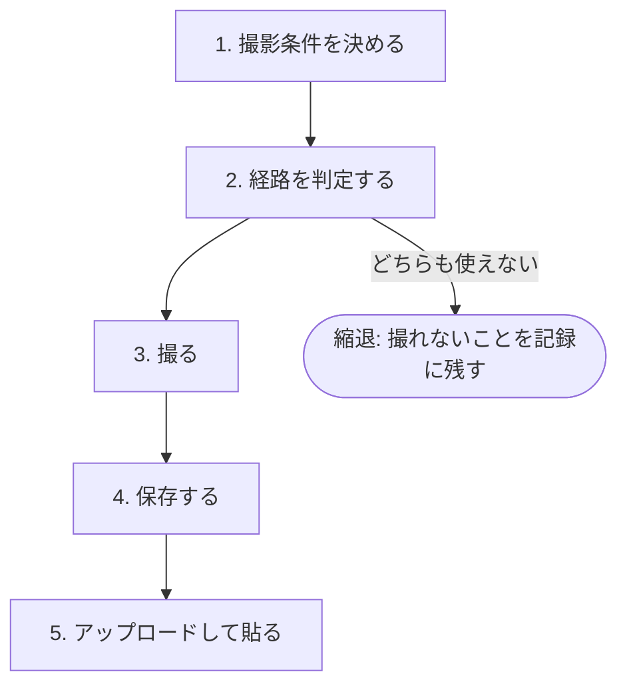
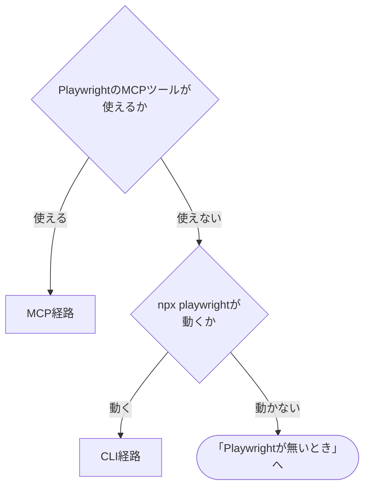

# gitlab-screenshot

UI変更は文章だけでは伝わらない。コードを読まない読み手が「何が変わったか」を判断するには画面が要る。

UI変更を見つけたら、明示の指示を待たずに撮る。撮影を人間の指示だけに頼ると撮り忘れが起きる。証跡が欠ける損失のほうが、余計に撮ってしまう損失より大きい。

## 前提

| 呼出元 | 場面 |
| --- | --- |
| `codex-ext:gitlab-develop` | Issue起票直後にBefore、実装完了時にAfterをMR本文へ |
| `codex-ext:gitlab-review` | 指摘に対応した後、修正後の画面を対応報告noteへ |
| 利用者の直接の依頼 (Claude Codeは`/codex-ext:gitlab-screenshot`、Codexは`$codex-ext:gitlab-screenshot`) | 単発の撮影 |

- GitLabの操作は`glab` CLIで行う。ホストは`git remote get-url origin`のURLから求める (`https://<ホスト>/<group>/<project>.git`、`git@<ホスト>:<group>/<project>.git`、`ssh://git@<ホスト>[:<port>]/...`のホスト部分)。`glab`が別のホストを見に行くときは`GITLAB_HOST=<ホスト>`を付けて実行する。`glab`が無い、認証が済んでいない、`jq`が無いときは`codex-ext:gitlab-init`へ案内する
- 撮影にはPlaywrightを使う。MCP経路 (PlaywrightのMCPサーバ) かCLI経路 (`npx playwright`) のどちらかが使える環境で動く。どちらも無いときの扱いは「Playwrightが無いとき」に書く
- 貼り付けた画像の見える範囲は、プロジェクトの可視性に従う。`internal`ならログインしている全員が、`public`なら誰でも見られる。貼る前に確認する

  ```bash
  glab api "projects/:id"
  ```

  出力JSONの`visibility`フィールドを読む。応答の判定と停止は[glab-response.md](../gitlab-develop/references/glab-response.md)に従う。

### `npx`の実行範囲

`npx`で実行してよいのは`playwright` (と`@playwright/mcp`) だけにする。任意のnpmパッケージを取得して実行するのは、撮影に必要な範囲を大きく超える。外部パッケージを実行する前に、パッケージ名、実行内容、ネットワーク取得の有無を利用者へ示す。

初回の実行ではPlaywright本体とブラウザのダウンロードが走る。時間がかかるのは正常。

## 手順



### 1. 撮影条件を決める

対象Issueの`### 検証方針`などに撮影条件があればそれに従う。無ければ埋める。

```markdown
**撮影条件**:

- URL: `http://localhost:<port>/<path>`
- 操作手順:
  1. 「ログイン」ボタンをクリック
  2. 保存後、トーストの表示を待つ
- ビューポート: `1280x720`
- 認証状態: 不要 / storage_stateを使う
- 撮影対象: 何を映す画面か (1行)
- 貼付先: MR本文 / MR note / Issue本文 / Issue note
- 対象IID: `<IID>`
```

操作手順は人間が読んで再現できる形で書く。セレクタや`ref`は書かない。`ref`はスナップショットのたびに変わるため記録に使えない。

対象UIが起動していない場合は、起動コマンドを次の順で探す。決め打ちしない。

1. 起動済みのポートがないか (`lsof -i :<port>`。`lsof`が無ければ`ss -ltn`)
2. `package.json`の`scripts.dev`・`scripts.start`、`Makefile`
3. `README.md`・`CLAUDE.md`・`AGENTS.md`の起動手順
4. 見つからなければ利用者に聞く

起動は承認を得てから行う。自分で起動したサーバは、最後に止めるか残すかを確認する。

#### URLの安全ガード

許可するのは次だけ。

- `http://localhost:*`・`http://127.0.0.1:*`
- 利用者が撮影条件で明示したURL

範囲外への遷移は確認を挟む。撮影を頼んだつもりが、無関係なサイトを操作されるのを防ぐ。

### 2. 経路を判定する

2つの経路がある。使えるほうを選ぶ。



MCPのツール名は、Claude Codeでは`mcp__playwright__browser_*`。Codexでは登録したMCPサーバの`browser_*`ツール。ツールが一覧に無ければ使えない。

MCPが登録されていても起動に失敗することがある。ブラウザのバイナリが無い場合に、次のようなエラーが出る。

```
Error: async initializeServer: Chromium distribution 'chrome' is not found at /opt/google/chrome/chrome
```

MCPの登録は利用者の設定にあたり、他のプロジェクトにも影響する。勝手に変えない。直すなら手順を示して承認を得る。直さずCLI経路で進めてもよい。

### 3. 撮る

#### MCP経路

```text
browser_navigate url=<URL>
browser_resize width=1280 height=720
browser_snapshot
browser_take_screenshot filename=<パス>.png fullPage=<true|false>
browser_close
```

(Claude Codeでは各ツール名の先頭に`mcp__playwright__`が付く。)

操作の前に必ず`browser_snapshot`を取る。`browser_click`などは要素の`ref`を要求し、`ref`はスナップショットからしか得られない。

必ず`browser_close`する。閉じないとブラウザが残る。

ビューポートは`browser_resize`で指定する。CLI経路の`--viewport-size`に相当する。

##### CLI経路との3つの違い

| 違い | 内容 |
| --- | --- |
| `file:`が使えない | `Access to "file:" protocol is blocked`で拒否されることがある。ローカルのHTMLを撮るならHTTPで配信する (`python3 -m http.server <port> --bind 127.0.0.1`など)。CLI経路は`file://`を直接開ける |
| 保存先がcwd相対 | `filename`はMCPサーバのcwd (通常はリポジトリのルート) から解決される。worktreeで作業していても、保存先はメインのworking treeになりうる。保存後に実際の場所を確かめる |
| ディレクトリを作らない | 保存先の親ディレクトリが無いと`ENOENT`で失敗する。先に`mkdir -p`する |

MCPは撮影と別に、リポジトリのルート直下へ`.playwright-mcp/`を作り、スナップショットとコンソールログを置く。commitに混入しないよう、利用者のリポジトリの`.gitignore`は書き換えず、`.git/info/exclude`へ追記する。

```bash
grep -qxF '.playwright-mcp/' "$(git rev-parse --git-path info/exclude)" || echo '.playwright-mcp/' >> "$(git rev-parse --git-path info/exclude)"
```

#### CLI経路

```bash
npx --yes playwright screenshot \
  --browser chromium \
  --viewport-size "1280,720" \
  "<URL>" "<出力パス>"
```

`--browser chromium`を指定する。既定は`chrome`で、そのバイナリが無い環境では失敗する。

`--full-page`でページ全体を撮る。待機が要るなら`--wait-for-timeout <ms>`。

CLI経路では画面の操作ができない。`screenshot`は開いて撮るだけで、クリックや入力を挟めない。操作を伴う撮影が要るならMCP経路か、操作後の状態を直接開けるURLが要る。この制約は撮影条件を決める段階で効いてくる。

#### 撮れたことを確かめる

撮影コマンドが返っただけでは、撮れた証拠にならない。

```bash
[ -s "<出力パス>" ] || echo "撮れていない (ファイルが無いか空)"
```

到達できないURLを渡した場合、`npx playwright screenshot`は終了コード1を返し、ファイルを作らない。ただしパイプに通すと終了コードが隠れる。

```bash
# 悪い例: $?はtailのものになり、常に0
npx --yes playwright screenshot ... | tail -2

# 良い例
LOG=$(mktemp); npx --yes playwright screenshot ... > "$LOG" 2>&1; echo "exit=$?"; rm -f "$LOG"
```

空ファイルはアップロードを素通りする。0バイトのPNGを投げると、GitLabはエラーを返さず`markdown`を返す。取り消せないため、アップロードの前にサイズを見る。

#### 破壊的な操作をしない

フォームの送信、削除ボタン、POST・DELETEを伴う操作は自動で実行しない。撮影のつもりでデータを消す事故が起きる。必要なら利用者の確認を取る。

#### 認証

パスワードを直接入力させない。ログイン済みの状態が要るなら、利用者が自分でログインしたブラウザから書き出した`storage_state`を使う。`storage_state`にはセッションが入っているので、リポジトリの外かgit管理外の場所に置き、commitしない。

### 4. 保存する

```
docs/screenshots/<target>-<IID>/<YYYYMMDD-HHMMSS>-<label>.png
```

`<target>`は`mr`か`issue`。Before/Afterなど複数枚は、連番ではなく意味の分かるlabelを付ける (`before-login`、`after-login`)。

`docs/screenshots/`は、貼り終えて確定したものだけをコミットする。試し撮りは残さない。リポジトリ規約に保存場所や`.gitignore`の定めがあればそれに従う。

### 5. アップロードして貼る

#### 貼る前に画像を見る

アップロードは取り消せない。GitLabにはuploadsの一覧APIも削除APIも無いことが多い。

```
$ glab api "projects/:id/uploads"
{"error":"404 Not Found"}
```

本文から``を消しても、ファイルはURLに残り続ける。URLを知っている人は見られる。

そのため、貼る前に必ず画像そのものを見る。撮ったつもりの範囲の外に何が写っているかは、見なければ分からない。画像を開いて確認できない環境では、貼らずに利用者へ確認を頼む。

| 写り込みやすいもの | どこに出るか |
| --- | --- |
| 顧客名・氏名・メールアドレス | 一覧画面、通知、ヘッダーのログイン名 |
| 本番のデータ | 検証環境のつもりが本番を向いていた場合 |
| トークン・セッション | 開発者ツールを開いたまま撮った場合、URLのクエリ文字列 |
| 別の作業の内容 | ブラウザのタブ名、ブックマークバー |

写っていたら貼らずに撮り直す。ビューポートを狭める、対象要素だけを撮る、テストデータへ差し替える。画像編集で塗り潰す方法は取らない (元の画像がローカルに残り、貼り間違いが起きる)。

判断に迷うものが写っていたら、貼る前に利用者へ確認する。

#### アップロード

```bash
FILE="<パス>"
[ -s "$FILE" ] || { echo "空か存在しない。アップロードしない"; exit 1; }
```

```bash
glab api "projects/:id/uploads" -X POST --form "file=@$FILE"
```

出力JSONの`markdown`フィールドの値を読み、以降の手順 (note投稿・本文追記) へそのまま書く。応答の判定と停止は[glab-response.md](../gitlab-develop/references/glab-response.md)に従う。

サイズの確認を省かない。空ファイルでもアップロードは成功し、壊れた画像のリンクが本文に残る。消せない。

返る`markdown`は``の形で、そのまま本文へ入れられる。複数枚は1枚ずつアップロードする。

| 貼付先 | 手順 |
| --- | --- |
| MR note | `glab mr note create <IID> --message "<markdownの値>"` |
| Issue note | `glab issue note <IID> --message "<markdownの値>"` |
| MR本文 | 現在の全文を取得 → 末尾へ追記 → 全文で更新 |
| Issue本文 | 同上 |

`glab mr note create`・`glab issue note`・本文更新の各コマンドも、応答の判定と停止は[glab-response.md](../gitlab-develop/references/glab-response.md)に従う。`glab`のバージョンによってサブコマンドが違うときは`glab mr note --help`で確かめる。

本文への追記は全文置換で行う。差分パッチではない。取得と更新の間に他のセッションが本文を変えていると、その変更を消す。そのため、取得から更新までを1つのコマンドブロックで続けて実行する。MR本文の例を示す。Issue本文は`merge_requests`を`issues`に替える。

```bash
set -euo pipefail
IID=<対象IID>
MARKDOWN='<アップロードで得たmarkdownの値>'
case "$IID" in
  ''|*[!0-9]*) echo "IIDが数字だけではない。ここで止めて利用者へ報告する"; exit 1 ;;
esac
WORK=$(mktemp -d)
glab api "projects/:id/merge_requests/$IID" > "$WORK/mr.json"
jq -e '.iid' "$WORK/mr.json" > /dev/null
jq -r '.description // ""' "$WORK/mr.json" > "$WORK/body.md"
printf '\n\n## スクリーンショット\n\n%s\n' "$MARKDOWN" >> "$WORK/body.md"
glab api "projects/:id/merge_requests/$IID" -X PUT --field "description=@$WORK/body.md" > "$WORK/put.json"
jq -e '.iid' "$WORK/put.json" > /dev/null && echo "更新できた"
rm -rf "$WORK"
```

`<IID>`を一時ファイル名やパスに使う前に数字だけであることを確認するのは、別のMRの本文を上書き・誤送信しないため。確認で止まったら次へ進まない。途中で失敗したらコマンド・終了コード・生ログを利用者へ示して止まる。

Before/Afterは並べて貼る。どちらがどちらか分かるよう見出しを付ける。

## Playwrightが無いとき

MCPツールが無く、`npx playwright --version`も動かない場合は、次の順で進める。

1. `node`と`npx`があるなら、CLI経路で撮れる。ブラウザを含むPlaywright本体のダウンロードが走ることを利用者へ伝え、許可を得てから`npx --yes playwright install chromium`を実行する。許可が出なければ3へ進む
2. 操作を伴う撮影が要る場合は、MCPの導入を案内する。登録は利用者の環境設定の変更になるので、コマンドを示すだけにして実行しない。Claude Codeは`claude mcp add playwright -- npx @playwright/mcp@latest`、Codexは`codex mcp add playwright -- npx @playwright/mcp@latest`。登録後は、セッションの再起動が要ることがある
3. `node`・`npx`も無い、または許可が出ない、UIが起動できない、そもそも画面が無い場合は縮退する。次の「撮れないとき」へ進む

## 撮れないとき

環境が無い、UIが起動できない、そもそも画面が無い。いずれの場合も、撮れないことを隠さず記録に残す。

```markdown
**スクリーンショット**: 撮影不可 (理由: <何が無いか>)
```

その上で、何がどう変わるかを文章で説明する。黙って省略しない。読み手は「UI変更なのに画面が無い」ことに気づけない。

## 失敗パターン

| 失敗 | 対処 |
| --- | --- |
| `npx playwright`が初回で時間がかかる | ブラウザのダウンロードが走っている。待つ |
| 日本語が豆腐になる (□□□) | フォントが無い。`fonts-noto-cjk`などの導入を提示する (承認後) |
| 日本語が化ける (`動作`) | 豆腐とは別の症状で、原因は文字コード。HTMLに`<meta charset="utf-8">`が無く、配信側も`charset`を返していない。ページ側を直す。`python3 -m http.server`は`charset`を付けない |
| MCPが`chrome is not found`で落ちる | ブラウザが無い。`npx playwright install chrome`を実行する (sudoを要求することがあるので利用者に実行してもらう)。MCPサーバの`--browser`に`chromium`は指定できない。受け付ける値は`chrome`・`firefox`・`webkit`・`msedge`のみ。CLI経路の`--browser chromium`とは別物で、そちらは有効 |
| アップロードは通るのに画像が出ない | 貼付先のプロジェクトが違う。`/uploads/`のパスはプロジェクトに紐づく |
| ブラウザが残った | `browser_close`を忘れている |
| `glab`が`git: exit status 128`で落ちる | gitリポジトリの外で実行している。リポジトリ内へ移る。エラー文はこの原因を示さないので気づきにくい |
| 撮影は成功したのに画像が空 | 到達できないURLを渡している。`[ -s <パス> ]`で先に弾く |

## 出口基準

- [ ] 撮影したスクリーンショットがIssue・MR・noteへ貼られている (縮退した場合は、撮れないことを記録に残した)
- [ ] 撮影条件 (URL・操作手順・ビューポート) が呼び出し元の指定と一致している
- [ ] 貼る前に画像そのものを見て、写り込みやすいもの (顧客名・本番データ・トークン等) が無いことを確認した
- [ ] 試し撮りを残さず、`docs/screenshots/`には貼り終えて確定したものだけをコミットした
