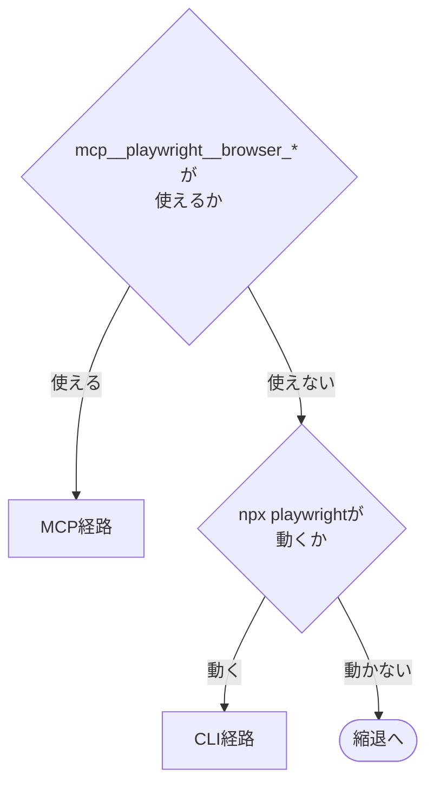

# gitlab-screenshot

UI変更は文章だけでは伝わらない。非エンジニアの読み手が「何が変わったか」を判断するには画面が要る。

**モデルの自動発火を切っていない**。UI変更を見つけたら撮る。撮影を人間の明示指示だけに頼ると撮り忘れが起きる。**証跡が欠ける損失のほうが、余計に撮ってしまう損失より大きい**。`codex-ext:gitlab-commit` (無指示でcommitしない) とは逆の判断になる。

## 前提

| 呼出元                                                                                                    | 場面                                               |
| --------------------------------------------------------------------------------------------------------- | -------------------------------------------------- |
| `codex-ext:gitlab-develop`                                                                                | Issue起票直後にBefore、実装完了時にAfterをMR本文へ |
| `codex-ext:gitlab-review`                                                                                 | 指摘に対応した後、修正後の画面を対応報告noteへ     |
| ユーザーが明示 (Claude Codeでは `/codex-ext:gitlab-screenshot`、Codexでは `$codex-ext:gitlab-screenshot`) | 単発の撮影                                         |

- MCP経路 (Playwright MCPの `browser_*` ツール。Claude Codeでは `mcp__playwright__browser_*`) かCLI経路 (`npx playwright`) のどちらかが使える環境で動く。どちらも使えなければ縮退し、撮れないことを記録に残す
- GitLabのhostは `git remote get-url origin` から求める (`git@host:group/proj.git` と `https://host/group/proj.git` の両形式。例: `gitlab.example.com`)。`glab` CLIを使い、`gh` は使わない。`glab` には `--hostname <host>` か環境変数 `GITLAB_HOST=<host>` でhostを渡す。未認証なら `glab auth login --hostname <host>` で認証する。`jq` が要る
- **`glab`はパイプ・コマンド置換を付けず単独で実行する**。sandbox付きのセッションでは付けるとsandbox内で走り、GitLabへの接続を拒否されることがある
- 貼り付けた画像の見える範囲は、**プロジェクトの可視性に従う**。`internal` ならログインしている全員が、`public` なら誰でも見られる。貼る前に確認する

  ```bash
  glab api "projects/:id"
  ```

  出力JSONの `visibility` フィールドを読む。応答の判定と停止は[glab-response.md](../gitlab-develop/references/glab-response.md)に従う。

### `npx` の実行範囲

`allowed-tools` に `Bash(npx playwright:*)` を入れている。**`Bash(npx:*)` にはしない**。それでは任意のnpmパッケージを取ってきて実行できてしまい、撮影に必要な範囲を大きく超える。

初回の実行ではPlaywright本体とブラウザのダウンロードが走る。時間がかかるのは正常。

## 手順


### 1. 撮影条件を決める

対象Issueの `### 検証方針` に撮影条件があればそれに従う。無ければ埋める。

```markdown
**撮影条件**:

- URL: `http://localhost:<port>/<path>`
- 操作手順:
  1. 「ログイン」ボタンをクリック
  2. 保存後、トーストの表示を待つ
- ビューポート: `1280x720`
- 認証状態: 不要 / storage_stateを使う
- 撮影対象: 何を映す画面か (1行)
- 貼付先: MR本文 / MR note / Issue本文 / Issue note
- 対象IID: `<IID>`
```

**操作手順は人間が読んで再現できる形で書く**。セレクタや `ref` は書かない。`ref` はスナップショットのたびに変わるため記録に使えない。

対象UIが起動していない場合は、起動コマンドを次の順で探す。**決め打ちしない**。

1. 起動済みのポートがないか (`lsof -i :<port>`)
2. `package.json` の `scripts.dev` / `scripts.start`、`Makefile`
3. `README.md` / `CLAUDE.md` の起動手順
4. 見つからなければユーザーに聞く

**起動は承認を得てから**。自分で起動したサーバーは、最後に止めるか残すかを確認する。

#### URLの安全ガード

許可するのは次だけ。

- `http://localhost:*` / `http://127.0.0.1:*`
- ユーザーが撮影条件で明示したURL

**範囲外への遷移は確認を挟む**。skillに撮影を頼んだつもりが、無関係なサイトを操作されるのを防ぐ。

### 2. 経路を判定する

2つの経路がある。**使えるほうを選ぶ**。



MCPが登録されていても**起動に失敗することがある**。ブラウザのバイナリが無い場合で、実際にこの環境では次が出る。

```
Error: async initializeServer: Chromium distribution 'chrome' is not found at /opt/google/chrome/chrome
```

MCPの登録はユーザーのグローバル設定 (Claude Codeなら `claude mcp list` で確認できる) にある。**グローバル設定なので勝手に変えない**。直すなら手順を提示して承認を得る。直さずCLI経路で進めてもよい。

### 3. 撮る

#### MCP経路

```text
mcp__playwright__browser_navigate url=<URL>
mcp__playwright__browser_resize width=1280 height=720
mcp__playwright__browser_snapshot
mcp__playwright__browser_take_screenshot filename=<パス>.png fullPage=<true|false>
mcp__playwright__browser_close
```

**操作の前に必ず `browser_snapshot` を取る**。`browser_click` などは要素の `ref` を要求し、`ref` はスナップショットからしか得られない。

**必ず `browser_close` する**。閉じないとブラウザが残る。

ビューポートは `browser_resize` で指定する。CLI経路の `--viewport-size` に相当する。

##### CLI経路との3つの違い

| 違い                   | 内容                                                                                                                                                                                   |
| ---------------------- | -------------------------------------------------------------------------------------------------------------------------------------------------------------------------------------- |
| `file:` が使えない     | `Access to "file:" protocol is blocked` で拒否される。ローカルのHTMLを撮るならHTTPで配信する (`python3 -m http.server <port> --bind 127.0.0.1` など)。CLI経路は `file://` を直接開ける |
| 保存先がcwd相対        | `filename` はMCPサーバーのcwd (通常はリポジトリのルート) から解決される。**worktreeで作業していても、保存先はメインのworking treeになる**                                              |
| ディレクトリを作らない | 保存先の親ディレクトリが無いと `ENOENT` で失敗する。先に `mkdir -p` する                                                                                                               |

MCPは撮影と別に、リポジトリのルート直下へ `.playwright-mcp/` を作り、スナップショットとコンソールログを置く。**`.gitignore` に入れる**。入れないとcommitに混入する。

```
.playwright-mcp/
```

#### CLI経路

```bash
npx --yes playwright screenshot \
  --browser chromium \
  --viewport-size "1280,720" \
  "<URL>" "<出力パス>"
```

`--browser chromium` を指定する。既定は `chrome` で、そのバイナリが無い環境では失敗する。

`--full-page` でページ全体を撮る。待機が要るなら `--wait-for-timeout <ms>`。

**CLI経路では画面の操作ができない**。`screenshot` は開いて撮るだけで、クリックや入力を挟めない。操作を伴う撮影が要るならMCP経路か、操作後の状態を直接開けるURLが要る。この制約は撮影条件を決める段階で効いてくる。

#### 撮れたことを確かめる

**撮影コマンドが返っただけでは、撮れた証拠にならない**。

```bash
[ -s "<出力パス>" ] || echo "撮れていない (ファイルが無いか空)"
```

到達できないURLを渡した場合、`npx playwright screenshot` は終了コード1を返し、ファイルを作らない。ただし**パイプに通すと終了コードが隠れる**。

```bash
# 悪い例 — $?はtailのものになり、常に0
npx --yes playwright screenshot ... | tail -2

# 良い例
npx --yes playwright screenshot ... > "$TMPDIR/pw.log" 2>&1; echo "exit=$?"
```

exit codeを確認したら消す。

```bash
rm -f "${TMPDIR:?}/pw.log"
```

**空ファイルはアップロードを素通りする**。0バイトのPNGを投げると、GitLabはエラーを返さず `markdown` を返す (実測済み)。取り消せないため、**アップロードの前にサイズを見る**。

#### 破壊的な操作をしない

フォームの送信、削除ボタン、POST・DELETEを伴う操作は**自動で実行しない**。撮影のつもりでデータを消す事故が起きる。必要ならユーザーの確認を取る。

#### 認証

**パスワードを直接入力させない**。ログイン済みの状態が要るなら `storage_state` を使う。参照する認証情報は、共有しないローカル設定から取る。

### 4. 保存する

```
docs/screenshots/<target>-<IID>/<YYYYMMDD-HHMMSS>-<label>.png
```

`<target>` は `mr` か `issue`。Before/Afterなど複数枚は、連番ではなく**意味の分かるlabel**を付ける (`before-login`、`after-login`)。

`docs/screenshots/` は**貼り終えて確定したものだけをコミットする**。試し撮りは残さない。`.gitignore` の扱いはリポジトリごとに決める。

### 5. アップロードして貼る

#### 貼る前に画像を見る

**アップロードは取り消せない**。GitLab (動作確認したのは16.11、CE) にはuploadsの一覧APIも削除APIも無い。

```
$ glab api "projects/:id/uploads"
{"error":"404 Not Found"}
```

本文から `` を消しても、**ファイルはURLに残り続ける**。URLを知っている人は見られる。

そのため**貼る前に必ず画像そのものを見る**。撮ったつもりの範囲の外に何が写っているかは、見なければ分からない。

| 写り込みやすいもの           | どこに出るか                                          |
| ---------------------------- | ----------------------------------------------------- |
| 顧客名・氏名・メールアドレス | 一覧画面、通知、ヘッダーのログイン名                  |
| 本番のデータ                 | 検証環境のつもりが本番を向いていた場合                |
| トークン・セッション         | 開発者ツールを開いたまま撮った場合、URLのクエリ文字列 |
| 別の作業の内容               | ブラウザのタブ名、ブックマークバー                    |

写っていたら**貼らずに撮り直す**。ビューポートを狭める、対象要素だけを撮る、テストデータへ差し替える。**画像編集で塗り潰す方法は取らない** (元の画像がローカルに残り、貼り間違いが起きる)。

判断に迷うものが写っていたら、貼る前にユーザーへ確認する。

#### アップロード

```bash
FILE="<パス>"
[ -s "$FILE" ] || { echo "空か存在しない。アップロードしない"; exit 1; }
```

```bash
glab api "projects/:id/uploads" -X POST --form "file=@$FILE"
```

出力JSONの `markdown` フィールドの値を読み、以降の手順 (note投稿・本文追記) へそのまま書く。応答の判定と停止は[glab-response.md](../gitlab-develop/references/glab-response.md)に従う。

**サイズの確認を省かない**。空ファイルでもアップロードは成功し、壊れた画像のリンクが本文に残る。消せない。

返る `markdown` は `` の形で、そのまま本文へ入れられる。複数枚は1枚ずつアップロードする。

| 貼付先     | 手順                                                   |
| ---------- | ------------------------------------------------------ |
| MR note    | `glab mr note create <IID> --message "<markdownの値>"` |
| Issue note | `glab issue note <IID> --message "<markdownの値>"`     |
| MR本文     | 現在の全文を取得 → 末尾へ追記 → 全文で更新             |
| Issue本文  | 同上                                                   |

**本文への追記は全文置換で行う**。差分パッチではない。`glab mr note create` / `glab issue note` / 本文更新の各コマンドも、応答の判定と停止は[glab-response.md](../gitlab-develop/references/glab-response.md)に従う。

**`<IID>`は一時ファイル名に使う前に数字だけであることを確認する**。一時ファイル名にIIDを入れるのは、並行して走る別のMRの本文を上書き・誤送信しないため。

```bash
IID=<対象IID>
case "$IID" in
  ''|*[!0-9]*) echo "IIDが数字だけではない。ここで止めてユーザーへ報告する" ;;
esac
```

止めると出たら次へ進まない。確認を通ったら本文を取る。

```bash
glab api "projects/:id/merge_requests/$IID"
```

出力JSONの `description` フィールドを読む。その末尾へ `## スクリーンショット` の見出しと、先の手順で読んだ `markdown` の値を追記した全文をWriteツールで `$TMPDIR/body-mr-$IID.md` へ書く。応答の判定と停止は[glab-response.md](../gitlab-develop/references/glab-response.md)に従う。

```bash
glab api "projects/:id/merge_requests/$IID" -X PUT --field "description=@$TMPDIR/body-mr-$IID.md"
```

反映を確認したら一時ファイルを消す。

```bash
rm -f "${TMPDIR:?}/body-mr-$IID.md"
```

**取得と更新の間に他のセッションが本文を変えていると、その変更を消す**。更新の直前に取り直す。

Before/Afterは並べて貼る。どちらがどちらか分かるよう見出しを付ける。

## 撮れないとき

環境が無い、UIが起動できない、そもそも画面が無い。いずれの場合も**撮れないことを隠さず記録に残す**。

```markdown
**スクリーンショット**: 撮影不可 (理由: <何が無いか>)
```

その上で、何がどう変わるかを文章で説明する。**黙って省略しない**。読み手は「UI変更なのに画面が無い」ことに気づけない。

## 失敗パターン

| 失敗                                      | 対処                                                                                                                                                                                                                                                                                    |
| ----------------------------------------- | --------------------------------------------------------------------------------------------------------------------------------------------------------------------------------------------------------------------------------------------------------------------------------------- |
| `npx playwright` が初回で時間がかかる     | ブラウザのダウンロードが走っている。待つ                                                                                                                                                                                                                                                |
| 日本語が豆腐になる (□□□)                  | フォントが無い。`fonts-noto-cjk` などの導入を提示する (承認後)                                                                                                                                                                                                                          |
| 日本語が化ける (`動作`)                 | 豆腐とは別の症状で、原因は文字コード。HTMLに `<meta charset="utf-8">` が無く、配信側も `charset` を返していない。ページ側を直す。`python3 -m http.server` は `charset` を付けない                                                                                                       |
| MCPが `chrome is not found` で落ちる      | ブラウザが無い。`npx playwright install chrome` を実行する (sudoを要求するためユーザーに実行してもらう)。**MCPサーバーの `--browser` に `chromium` は指定できない** — 受け付ける値は `chrome` `firefox` `webkit` `msedge` のみ。CLI経路の `--browser chromium` とは別物で、そちらは有効 |
| アップロードは通るのに画像が出ない        | 貼付先のプロジェクトが違う。`/uploads/` のパスはプロジェクトに紐づく                                                                                                                                                                                                                    |
| ブラウザが残った                          | `browser_close` を忘れている                                                                                                                                                                                                                                                            |
| `glab` が `git: exit status 128` で落ちる | gitリポジトリの外で実行している。リポジトリ内へ移る。エラー文はこの原因を示さないので気づきにくい                                                                                                                                                                                       |
| 撮影は成功したのに画像が空                | 到達できないURLを渡している。`[ -s <パス> ]` で先に弾く                                                                                                                                                                                                                                 |

## 出口基準

- [ ] 撮影したスクリーンショットがIssue/MR/noteへ貼られている (縮退した場合は、撮れないことを記録に残した)
- [ ] 撮影条件 (URL・操作手順・ビューポート) が呼び出し元の指定と一致している
- [ ] 貼る前に画像そのものを見て、写り込みやすいもの (顧客名・本番データ・トークン等) が無いことを確認した
- [ ] 試し撮りを残さず、`docs/screenshots/` には貼り終えて確定したものだけをコミットした
